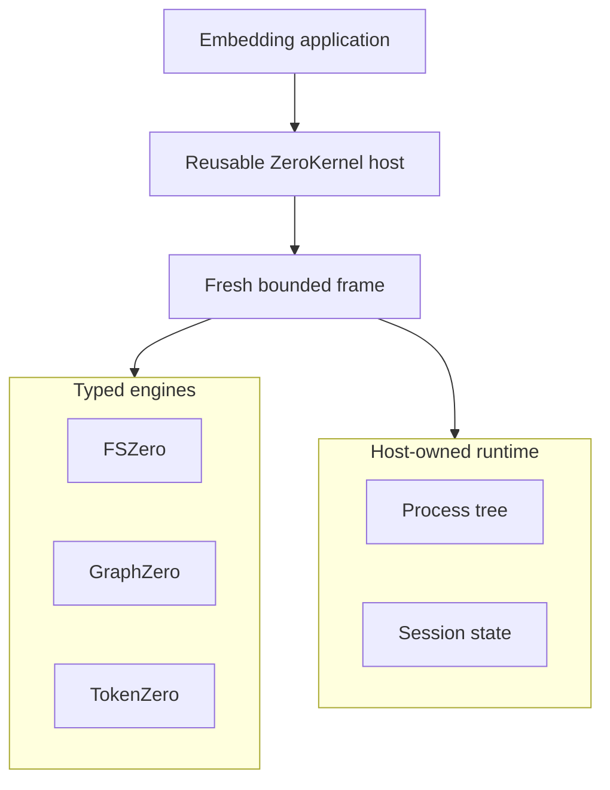
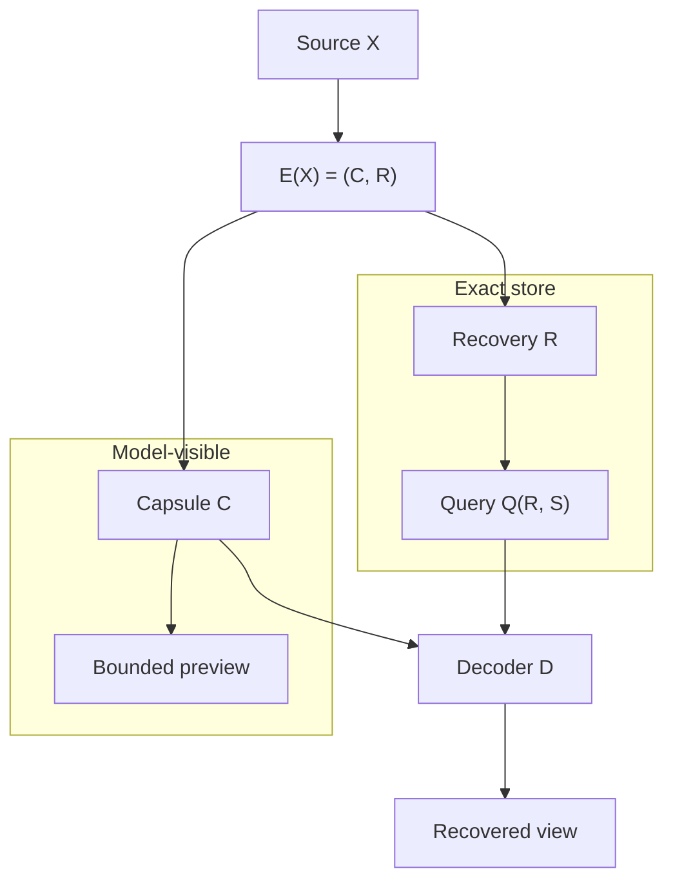

# ZeroStack

<div align="center">

[](#the-six-operations)
[](#recovery-aware-context-compression)
[](rust-toolchain.toml)
[](contracts/README.md)
[](LICENSE)

</div>

ZeroStack is a Rust workspace for a daemonless, in-process agent kernel. It composes exact filesystem authority, structural code intelligence, and output accounting behind one six-operation API.

ZeroKernel is the only model-facing execution surface. A reusable host creates one fresh, bounded JavaScript or TypeScript frame per cell. ZeroStack owns lifecycle, budgets, cancellation, transactions, child processes, session state, and the terminal response. FSZero, GraphZero, and TokenZero provide typed engine contracts and never import one another.

Large results are projected with **byte-aware recovery-aware context compression (RACC)**. The model sees a compact capsule. The original bytes stay recoverable behind content-addressed handles. Quality is guarded by exact recovery and fallback, not by summarization, reasoning-token cuts, or a weaker model.

## Contents

- [What ZeroKernel is](#what-zerokernel-is)
- [Authority boundaries](#authority-boundaries)
- [Recovery-aware context compression](#recovery-aware-context-compression)
- [The six operations](#the-six-operations)
- [Examples](#examples)
- [Guarantees](#guarantees)
- [Quick start](#quick-start)
- [Node embedding](#node-embedding)
- [Troubleshooting](#troubleshooting)
- [FAQ](#faq)
- [Papers](#papers)
- [Documentation](#documentation)
- [Contributing and security](#contributing-and-security)
- [License](#license)

## What ZeroKernel is

An embedding application creates one `ZeroKernel` host for a workspace, session, and budget. The host retains initialized engine adapters and durable roots. Every call creates a fresh frame that owns its interpreter values, promises, cancellation token, staged filesystem transaction, child processes, and dirty state. Completion, failure, or cancellation settles every owned resource and destroys the frame.



ZeroKernel opens no network listener and starts no machine-wide daemon. Rust hosts and the asynchronous Node binding both run in-process.

## Authority boundaries

| Owner | Authority | Visible through ZeroKernel |
| --- | --- | --- |
| ZeroStack | Host lifecycle, budgets, cancellation, transactions, processes, session state, terminal response | All six operations and the final `ZeroKernelResponse` |
| FSZero | Exact bytes, snapshots, guarded file effects, restoration | `z.read`, `z.edit`, `z.apply` |
| GraphZero | Syntax, symbols, relationships, freshness, coverage | `z.find` |
| TokenZero | Measurement, projection, compression, exact expansion | Automatic at operation and response boundaries |

Authority is narrow by design. A graph result does not become file content. A compact projection does not become source bytes. A staged receipt does not commit the cell on its own. See `docs/architecture.md` and `docs/components.md` for the full boundary table and flow.

Engines never import one another. Hub composition lives under `crates/zerostack`. Cross-engine behavior has one place to audit.

## Recovery-aware context compression

RACC is the output economics of ZeroKernel. TokenZero applies it automatically at operation and response boundaries.

A source observation $X$ is encoded as

$$
E(X)=(C,R)
$$

where $C$ is the model-visible capsule and $R$ is exact expandable recovery state. Later demand $S$ may query $R$:

$$
\widehat{Y} = D(C,S,Q(R,S)).
$$



The capsule is not authority. Authority remains in exact bytes, snapshots, receipts, and restoration paths. ZeroKernel recovers those bytes through `z.read` on a `z://blob/<digest>` handle.

The working principle of the research series:

> Never compress away an ability. Compress the repeated cost of making that ability available.

### How this differs from common approaches

| Approach | What it changes | What goes wrong |
| --- | --- | --- |
| Truncation / sliding windows | Drops oldest or longest bytes | Evidence disappears. There is no exact preimage. |
| Summarization | Replaces source with an interpretation chosen before the task finishes | The omitted fact may be the one the later step needed. There is no proof of what changed. |
| Reasoning-token cuts | Lowers thinking budget to save tokens | The model's deliberation is the thing being spent down. |
| Smaller or cheaper models | Changes the decision maker | Cost falls because capability fell. |
| Lossy neural compression | Approximates the payload | Approximate bytes are the wrong contract for patches, hashes, and legal identifiers. |
| **RACC** | Splits visibility from recoverability | Omitted bytes stay in a local store. Expansion returns original bytes. Honest accounting charges those recovered tokens. |

RACC does not claim that a shorter string preserves every task for every model. A non-injective transform can merge two worlds that require incompatible actions. Even an injective recoding can change a fixed model's behavior. The largest universal statement is a **protocol** theorem: publish a compact candidate only with a sound certificate; otherwise deoptimize to the raw baseline.

### Exactness ladder

RACC names four properties that are often mixed together. A claim must say which rung it is on.

1. **Byte exactness.** Every referenced byte string is recovered exactly.
2. **Anchor exactness.** Every protected anchor is present or exactly recoverable.
3. **Decision exactness.** The protected action law matches the full-context action law.
4. **Task nonregression.** A sound verifier and rollback keep task success no lower than baseline.

Byte exactness alone does not imply the later rungs. Storage recoverability is not the same as quality preservation. A protocol is recovery-live when a history that cannot yet choose a baseline-safe effect must either acquire more evidence or fall back before an irreversible semantic action.

### Carried cost

Visible savings on the first response are not the objective. Token mass injected at turn $i$ occupies the remaining horizon. The recovery-aware ledger is

$$
M = M_{\mathrm{vis}} + M_{\mathrm{rec}} + \rho_{\mathrm{retry}} N_{\mathrm{retry}} + \rho_{\mathrm{fail}} C_{\mathrm{fail}}.
$$

If an inline policy presents masses $m_i$ at turn zero and a RACC policy presents the same masses at turns $t_i$, the carried-cost identity is

$$
M_{\mathrm{inline}} - M_{\mathrm{RACC}} = \sum_i m_i t_i - H_{\mathrm{RACC}}.
$$

The economic mechanism is demand-adaptive deferral. Semantic similarity is not a substitute for that identity.

TokenZero may omit payload text from the visible capsule only when one of these is true:

- the omitted content is already represented by a protected anchor;
- the omitted content is recoverable through an exact local handle;
- the mode explicitly chooses lossy visible compression and reports that recovery may be needed.

Zero loss by recovery holds while the cache entry exists: expand returns the original payload, never a second summary. Under pressure the oldest entries evict first (FIFO by first insertion). An evicted handle reports `dangling-ref`; it never returns the wrong bytes.

See [`docs/racc/RACC.md`](docs/racc/RACC.md).

## The six operations

| Operation | Contract |
| --- | --- |
| `z.read` | Read files, directories, snapshots, exact handles, and bounded selections |
| `z.find` | Search text or structure; query definitions, references, callers, imports, paths, and semantics |
| `z.edit` | Create, replace, remove, or patch one file with exact preimage guards |
| `z.apply` | Apply an atomic multi-file operation set or typed effect request |
| `z.run` | Run one bounded process with owned cancellation and recoverable output |
| `z.state` | Get, set, has, delete, or list small session-scoped JSON facts |

There is no guest transaction method. Every mutation in a cell already shares one host-owned transaction. Normal JavaScript or TypeScript provides orchestration.

## Examples

Independent work uses `Promise.all`. Dependent work stays in the same bounded cell.

```javascript
const [source, callers] = await Promise.all([
  z.read("src/lib.rs"),
  z.find("execute_cell", { mode: "callers", path: "src" }),
]);

if (callers.hits.length === 0) {
  return { source, decision: "No callers found" };
}

return { source, callers };
```

A normal UTF-8 file returns complete content. A large value returns a bounded view plus an exact handle that `z.read` can recover.

```javascript
const lines = await z.read("src/lib.rs", { range: "18:42" });
const snapshot = await z.read({ path: "src/lib.rs", view: { mode: "decision" } });
const page = await z.read(snapshot.source.exact, { offset: 4096, limit: 4096 });
const dir = await z.read("src", { recursive: false });
```

Guarded edits use a snapshot that carries the exact preimage.

```javascript
const snapshot = await z.read({
  path: "src/config.rs",
  view: { mode: "decision" },
});

return await z.edit(snapshot, {
  find: "const RETRIES: usize = 2;",
  replacement: "const RETRIES: usize = 3;",
});
```

Processes are bounded and owned by the host.

```javascript
return await z.run(["git", "status", "--short"], {
  cwd: ".",
  timeoutMs: 30000,
});
```

Session state carries small JSON facts across otherwise fresh frames.

```javascript
await z.state.set("selected-path", "src/lib.rs");
const selectedPath = await z.state.get("selected-path");
return await z.read(selectedPath);
```

A structured handle returned inside a snapshot or projection is accepted by later `z.read` and `z.edit` calls. Do not write an outline or preview back as if it were the source file.

## Guarantees

**Effects and atomicity.** The first file mutation lazily opens one cell transaction. FSZero returns exact preimages and typed receipts. A completed cell publishes effects and a successor state root at the terminal boundary. Failure, cancellation, verification failure, state publication failure, or output publication failure restores receipts in reverse order and leaves the prior state root authoritative. `z.edit` changes one file. `z.apply` changes an atomic set.

**Cancellation and cleanup.** One cancellation token reaches the interpreter, engine calls, concurrent promises, and the owned process tree. On failure or cancellation ZeroKernel requests sibling cancellation, terminates the exact child tree, waits for task and process counters to reach zero within a bounded window, rolls back staged effects and session state, records one terminal event, and destroys the frame. A response cannot report completion while its frame still owns tasks or child processes.

**Process ownership.** `z.run` belongs to ZeroStack. It validates the working directory, starts the exact child tree, captures bounded output, and terminates and reaps descendants on timeout, cancellation, frame failure, shutdown, or object destruction. TokenZero projects captured output but never owns the process lifecycle.

**Determinism and exact recovery.** Source bytes are authoritative through FSZero snapshots and CAS content addressing. Outputs pass through TokenZero measurement and projection at operation and response boundaries. Small values pass through unchanged. Larger values return a bounded projection plus an opaque `z://blob/<digest>` handle whose recovery returns exact bytes. Handles are content-addressed and recovery contributes to recovery-aware accounting. The terminal event records the exact projection or structured error digest.

**State.** `z.state` is a bounded session-scoped JSON map for small facts that must survive fresh frames, such as a selected path or workflow checkpoint. The host hydrates state from the committed CAS root before evaluation and commits a successor root with compare-and-set only on completed dirty cells. Interpreter variables, imports, and promises never persist across cells.

**Terminal response.** Every accepted cell returns one structured response. Completed output is the exact TokenZero projection recorded by the terminal event. No extra model-visible envelope is added.

```typescript
interface ZeroKernelResponse {
  protocol: "ZeroKernel";
  outcome: "Completed" | "Cancelled" | "Failed";
  value?: unknown;
  error?: { kind: string; detail: string; retryable: boolean };
  handles: string[];
  event: string;
  state: { before?: string; after?: string; unchanged: boolean };
  ledger: ResourceLedger;
}
```

## Quick start

This repository is source-only. There is no Homebrew formula, npm package, or Pi extension to install. Do not try to download or package-manager-install ZeroStack. Build from this workspace if you are developing it.

```bash
git clone https://github.com/AdityaVG13/zerostack
cd zerostack

# Build the host
cargo build -p zero-kernel

# Focused host contract
cargo test -p zero-kernel --test direct_host

# Frame syntax and codemode
cargo test -p zero-codemode --test syntax
```

Use the narrowest relevant test target during development. Domain tests live under `tests/fszero`, `tests/graphzero`, `tests/tokenzero`, and `tests/support`. Name the package and exact `--lib`, `--bin`, or `--test` target.

The CLI binary is `zero-kernel` in `crates/zerostack/zero-kernel`. It exposes `doctor`, `health`, `exec`, `mcp` (when built with the `mcp-carrier` feature), and `migrate`. `exec` reads one cell from stdin and is intended for diagnostics, not as the production model path.

### Command reference

| Command | Purpose |
| --- | --- |
| `cargo build -p zero-kernel --bin zero-kernel` | Build the standalone diagnostic CLI |
| `zero-kernel doctor -C <workspace>` | Validate the workspace and durable ZeroStack store |
| `zero-kernel exec -C <workspace>` | Read one JavaScript or TypeScript cell from stdin |
| `zero-kernel mcp -C <workspace>` | Run the optional stdio carrier when `mcp-carrier` is enabled |
| `cargo test -p zero-kernel --test direct_host <test-name> -- --exact` | Run one focused host contract |
| `cargo run --manifest-path xtask/Cargo.toml -- doctor --json` | Inspect repository layout and required files |
| `node demo/run.js` | Exercise FSZero, GraphZero, and TokenZero through one cell |

Reference benchmark evidence is under `benchmarks/`. Reproduce the host lifecycle and fixtures with:

```bash
node benchmarks/zero-kernel-reference.cjs
```

Retained samples, environment metadata, and method are in `benchmarks/zero-kernel-reference.json`.

## Node embedding

The Node binding is `crates/zerostack/zero-kernel-node`, loaded from `bindings/node` in this workspace. It is not an npm registry package. It is an asynchronous N-API class that embeds the same Rust host in-process. It selects an exact platform prebuild or the explicit development override. It does not compile, download, or start a service at runtime.

Build and stage a prebuild from source:

```bash
cargo build --profile release-node -p zero-kernel-node
cp target/release-node/libzero_kernel_node.dylib \
  bindings/node/prebuilds/darwin-arm64/zero_kernel_product.node
```

Embed in an application:

```javascript
const { ZeroKernel } = require("./bindings/node");

const kernel = new ZeroKernel({ root: process.cwd(), sessionId: "example" });
await kernel.initialize();

const response = await kernel.executeCell("return await z.read('README.md');");

await kernel.shutdown();
```

The binding exposes `initialize()`, `executeCell(source, signal?)`, `status()`, and `shutdown()`. A ZeroKernel failure is a structured terminal outcome with `outcome`, `error`, `event`, `state`, and `ledger`. Do not rerun the same source through an unsandboxed fallback. For development only, `ZERO_KERNEL_NATIVE_ADDON` may point to an explicit addon file.

## Troubleshooting

TokenZero exposes enough accounting to explain why a value passed through, compressed, spilled, or later lost some of its apparent savings. Start with content kind, tokenizer identity, raw and visible counts, recovery handles, and any subsequent expansion events.

<details>
<summary><strong>A small read was not compressed</strong></summary>

This is expected when raw output is already below the visibility budget, or when capsule framing, anchors, and refs would cost as much as the original. TokenZero optimizes total task cost, not the percentage shown on every operation.

Inspect the accounting block to confirm raw and visible counts are equal and the content kind was classified correctly. Do not lower thresholds solely to force a compression badge; tiny capsules add indirection without saving context. If a genuinely large repetitive value passes through, capture its content classification and projection decision for diagnosis.

</details>

<details>
<summary><strong>An exact handle does not expand</strong></summary>

The handle identifies content. It does not carry the content or guarantee that every process can reach its store. Expansion fails when the configured recovery root lacks the object, the object was evicted, the handle belongs to another isolated store, or digest verification detects corruption.

Run `zero-kernel doctor -C <workspace>` and inspect the recovery root, store health, and handle scheme. Confirm that the resolving process uses the same durable store or an explicitly shared verified store. Do not rewrite the scheme or fabricate a new digest. If the object was pruned, regenerate it from the original source rather than treating a similar payload as equivalent.

Pass the `z://blob/<digest>` handle back to `z.read`. Do not write an outline or preview back to disk as if it were the source.

</details>

<details>
<summary><strong>Reported savings dropped after an expand</strong></summary>

That is the intended recovery-aware accounting model. The original projection avoided sending some tokens, but expansion later sent a subset back to the model. Those recovered tokens are subtracted from net savings.

Compare raw, initially visible, recovered, and final spent counts rather than only the first response. A task that eventually expands everything may still benefit from delayed selection, but it should not claim the original headline percentage as net savings. This prevents compression from looking successful merely because its cost moved to a later turn.

</details>

<details>
<summary><strong>Telemetry is missing</strong></summary>

Shareable usage telemetry is off by default, and TokenZero has no exporter. Normal operation still returns per-call accounting in the ZeroKernel ledger; what is absent is the optional local cross-call ledger.

Set `TOKENZERO_TELEMETRY=1` before starting the process if you want the local three-field JSONL ledger. Confirm the recovery directory is writable. The setting is not retroactive, and enabling it does not upload records or recover calls made while it was disabled.

</details>

## FAQ

RACC separates what the model needs to see now from what the system must preserve exactly. These answers explain where that differs from summarization, caching, shell execution, and ordinary token-count claims.

<details>
<summary><strong>How is RACC different from summarization?</strong></summary>

Summarization replaces source detail with an interpretation chosen before the task is complete. When that interpretation omits the wrong fact, the agent must re-read, re-run, or guess, and there may be no way to prove what the summary changed.

RACC keeps omitted bytes in a content-addressed local store and returns exact handles plus protected anchors. The visible capsule can therefore be aggressive without becoming the only copy. Expansion returns original bytes, not a second summary.

</details>

<details>
<summary><strong>How is the recovery store different from a cache?</strong></summary>

The recovery store retains content-addressed objects, which is cache-like. RACC also classifies content, measures serialized values, chooses projection policy, preserves anchors, enforces output budgets, and accounts for later recovery.

A cache primarily avoids recomputation or I/O. TokenZero's contract is model-visible output economics with exact recovery. Eviction policy bounds local storage, but a cache hit alone does not establish token savings.

</details>

<details>
<summary><strong>Does TokenZero own shell execution?</strong></summary>

No. ZeroStack owns command admission, working-directory validation, process creation, timeout, cancellation, exact child-tree termination, and reaping. Those responsibilities determine whether an execution is safe and complete.

TokenZero receives captured stdout and stderr, measures their serialized form, projects a bounded visible result, and preserves omitted stream bytes behind exact handles. Keeping these boundaries separate prevents output formatting from changing process lifecycle semantics.

`z.run` is the ZeroKernel operation for that process.

</details>

<details>
<summary><strong>Can a capsule cost more than raw output?</strong></summary>

The policy should pass through content when capsule framing, anchors, and refs do not reduce the visible cost. That is why small files and path-only outputs often look unchanged.

There can still be local storage and measurement overhead, so "visible tokens did not increase" is not a universal performance claim. Benchmark token counting, projection latency, storage, and end-to-end task behavior separately.

</details>

<details>
<summary><strong>How are token savings calculated after recovery?</strong></summary>

The raw count measures the original serialized value. The visible count measures what entered context initially. Expansion adds recovered tokens to the task's spent total. Net savings compare raw cost with visible plus recovered cost under the same tokenizer.

Exact handle tokens and framing also belong in the visible side of the accounting. Cached or estimated values must be labeled by count kind rather than mixed into exact totals.

</details>

<details>
<summary><strong>Do recovery handles expose private content?</strong></summary>

A `z://blob/<digest>` handle is an identifier, not a public endpoint or an encoded copy of the payload. Someone who sees the string still needs access to a store containing the object.

The underlying bytes remain sensitive and should be protected with the same filesystem permissions and retention policy as other local agent data. Sharing a store or exporting a pack is an explicit data transfer; digest verification proves identity, not authorization.

</details>

<details>
<summary><strong>Should classic MCP be registered beside ZeroKernel?</strong></summary>

No. Multi-engine agent workflows should use ZeroKernel so filesystem, graph, output, state, cancellation, and transactions share one lifecycle. Registering classic MCP beside ZeroKernel in the same session creates overlapping read and recovery paths and makes accounting harder to interpret.

The optional `zero-kernel mcp` binary is a diagnostic stdio carrier when built with `mcp-carrier`. It is not a second model-facing catalog.

</details>

<details>
<summary><strong>Why not cut reasoning tokens or switch to a smaller model?</strong></summary>

Those tactics save tokens by reducing the decision maker. RACC-R treats reasoning capacity and reasoning continuation state as protected objects. The strict profile preserves them and minimizes only avoidable repeated work: re-reading stable files, re-emitting unchanged output, replaying certified continuations.

The guarded publication protocol $P$ emits a candidate $C$ only with a sound acceptance certificate $A$; otherwise it deoptimizes to the frozen same-model baseline $B$. Under those assumptions, protected utility is pointwise no worse than baseline. There is no theorem that "shorter implies same quality."

</details>

## Papers

The RACC statements in this README come from a research series on recovery-aware compression, exact causal communication, and guarded publication. Those manuscripts are research drafts. They have not been peer reviewed, and they are not shipped in this tree.

| Draft | What it states |
| --- | --- |
| RACC foundations | Encoder $E(X)=(C,R)$, exactness ladder, carried-cost identity |
| Exact causal frontier | Action sufficiency and sound fallback with zero protected degradation |
| RACC-R formal core | No universal compression-transform theorem; guarded publication |
| Literature positioning | Attribute Shannon, Wyner-Ziv, Blackwell, and Nerode; claim composition, not those mechanisms |

## Documentation

| Document | Purpose |
| --- | --- |
| `docs/README.md` | Index of the published documentation set |
| `docs/architecture.md` | Authority boundaries, lifecycle, effects, and scheduling |
| `docs/components.md` | FSZero, GraphZero, TokenZero, and hub responsibilities |
| `docs/racc/RACC.md` | Recovery-aware output projection and exact expansion |
| `docs/fszero/` | Filesystem and byte authority |
| `docs/graphzero/` | Structure and query authority |
| `docs/tokenzero/` | Output economics and accounting |
| `contracts/README.md` | Machine-readable contract inventory and change rules |
| `crates/zerostack/zerostack-conformance/CONTRACT.md` | Shared executable conformance contract |
| `packaging/README.md` | Not a public distribution root; no installable packages |
| `benchmarks/README.md` | Benchmark harness and evidence notes |

Typed contracts live in `contracts/` and `crates/zerostack/zero-abi`. Historical execution catalogs remain available through Git history rather than as supported surfaces.

## Contributing and security

Read `CONTRIBUTING.md` before changing engine contracts or the six-operation surface. Report vulnerabilities through `SECURITY.md`. ZeroStack is harness-agnostic and can be embedded by any compatible caller.

## License

MIT. See `LICENSE`.
