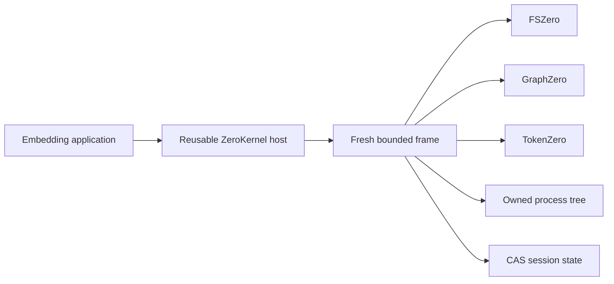

# ZeroStack

<div align="center">

[](#project-status)
[](rust-toolchain.toml)
[](#repository-snapshot)
[](#the-six-operations)
[](contracts/README.md)
[](LICENSE)

</div>

ZeroStack is a Rust workspace for a daemonless, in-process agent kernel. It composes exact filesystem authority, structural code intelligence, and output accounting behind one six-operation API.

ZeroKernel is the only model-facing execution surface. A reusable host creates one fresh, bounded JavaScript or TypeScript frame per cell. ZeroStack owns lifecycle, budgets, cancellation, transactions, child processes, session state, and the terminal response. FSZero, GraphZero, and TokenZero provide typed engine contracts and never import one another.

## Project status

ZeroStack is under active development. The six-operation surface is canonical, while package and engine contracts may still change. Homebrew, npm, and Pi files are private pre-release scaffolds, not publication claims. There is no standalone end-user application or tagged ZeroStack release yet.

### Repository snapshot

| Tracked fact | Current value |
| --- | ---: |
| Cargo workspace packages | 48 |
| Hub packages under `crates/zerostack` | 15 |
| FSZero packages | 7 |
| GraphZero packages | 14 |
| TokenZero packages | 10 |
| Machine-readable contract inputs | 9 |
| Tracked documentation files | 33 |
| Consolidated fuzz targets | 6 |
| Preserved benchmark files | 143 |

The package counts come from `cargo metadata --no-deps`. File counts include only Git-tracked inputs.

## TL;DR

**The problem:** agent runtimes often split file state, structural search, output projection, process control, and recovery across unrelated catalogs. The caller must choose transports and compose partial failure behavior itself.

**The solution:** ZeroKernel exposes `z.read`, `z.find`, `z.edit`, `z.apply`, `z.run`, and `z.state` in one bounded cell. The host coordinates typed engines, owns cancellation and rollback, and returns one terminal response with exact recovery handles and resource accounting.

### What exists now

| Area | Current implementation |
| --- | --- |
| Host | Reusable Rust `ZeroKernel` with fresh frames, budgets, task accounting, cancellation, and one terminal outcome |
| FSZero | Exact reads, snapshots, guarded edits, atomic application, receipts, and restoration |
| GraphZero | Text and syntax search, symbols, references, callers, freshness, coverage, and impact evidence |
| TokenZero | Token measurement, bounded projection, compression, exact expansion, and recovery-aware accounting |
| Processes and state | Owned child-process trees plus CAS-backed session facts across otherwise fresh frames |
| Contracts | Nine machine-readable inputs plus a shared executable conformance crate |
| Distribution | Head-only Homebrew, private npm operator, and private Pi package scaffolds |
| Evidence | Preserved benchmark harnesses, exact source handles, operation traces, and resource ledgers |

### Current boundaries

- No tagged ZeroStack release exists. Homebrew is head-only, and npm and Pi packaging remain private.
- The Git-tracked Node prebuild currently covers Darwin ARM64. Other platforms build the native addon from source.
- The Pi package registers only a local status command. Native ZeroKernel tools are not exposed through Pi yet.
- Benchmark files document their recorded workload and machine boundary. They are not universal performance claims.
- Structural absence is claimable only when GraphZero reports complete, fresh coverage for the requested scope.

## What ZeroKernel is

An embedding application creates one `ZeroKernel` host for a workspace, session, and budget. The host retains initialized engine adapters and durable roots. Every call creates a fresh frame that owns its interpreter values, promises, cancellation token, staged filesystem transaction, child processes, and dirty state. Completion, failure, or cancellation settles every owned resource and destroys the frame.



ZeroKernel opens no network listener and starts no machine-wide daemon. Rust hosts and the asynchronous Node binding both run in-process.

## Authority boundaries

| Owner | Authority | Visible through ZeroKernel |
| --- | --- | --- |
| ZeroStack | Host lifecycle, budgets, cancellation, transactions, processes, session state, terminal response | All six operations and the final `ZeroKernelResponse` |
| FSZero | Exact bytes, snapshots, guarded file effects, restoration | `z.read`, `z.edit`, `z.apply` |
| GraphZero | Syntax, symbols, relationships, freshness, coverage | `z.find` |
| TokenZero | Measurement, projection, compression, exact expansion | Automatic at operation and response boundaries |

Authority is narrow by design. A graph result does not become file content. A compact projection does not become source bytes. A staged receipt does not commit the cell on its own. See `docs/architecture.md` and `docs/components.md` for the full boundary table and flow.

Engines never import one another. Hub composition lives under `crates/zerostack`. Cross-engine behavior has one place to audit.

## Repository layout

```
crates/zerostack/   ZeroKernel hub, ABI, stores, processes, gates, and conformance
crates/fszero/      byte and filesystem authority
crates/graphzero/   structural search, relationships, freshness, and coverage
crates/tokenzero/   measurement, projection, compression, and exact recovery
contracts/          machine-readable contracts, fixtures, matrices, and digest pins
tests/              hub integration tests, domain tests, and shared support
docs/               canonical architecture, engine guides, and RACC documentation
packaging/package/  pre-release Homebrew, npm, and Pi distribution scaffolds
bindings/node/      source and native prebuilds for @zerostack/zero-kernel
demo/               one end-to-end ZeroKernel example covering all three engines
fuzz/               one cargo-fuzz workspace for hub and engine targets
xtask/              repository maintenance CLI
scripts/            public-surface and release-perf build helpers
benchmarks/         preserved reference harnesses and measured evidence
```

## The six operations

| Operation | Contract |
| --- | --- |
| `z.read` | Read files, directories, snapshots, exact handles, and bounded selections |
| `z.find` | Search text or structure; query definitions, references, callers, imports, paths, and semantics |
| `z.edit` | Create, replace, remove, or patch one file with exact preimage guards |
| `z.apply` | Apply an atomic multi-file operation set or typed effect request |
| `z.run` | Run one bounded process with owned cancellation and recoverable output |
| `z.state` | Get, set, has, delete, or list small session-scoped JSON facts |

There is no guest transaction method. Every mutation in a cell already shares one host-owned transaction. Normal JavaScript or TypeScript provides orchestration.

## Examples

Independent work uses `Promise.all`. Dependent work stays in the same bounded cell.

```javascript
const [source, callers] = await Promise.all([
  z.read("src/lib.rs"),
  z.find("execute_cell", { mode: "callers", path: "src" }),
]);

if (callers.hits.length === 0) {
  return { source, decision: "No callers found" };
}

return { source, callers };
```

A normal UTF-8 file returns complete content. A large value returns a bounded view plus an exact handle that `z.read` can recover.

```javascript
// Bounded views and exact recovery
const lines = await z.read("src/lib.rs", { range: "18:42" });
const snapshot = await z.read({ path: "src/lib.rs", view: { mode: "decision" } });
const page = await z.read(snapshot.source.exact, { offset: 4096, limit: 4096 });
const dir = await z.read("src", { recursive: false });
```

Guarded edits use a snapshot that carries the exact preimage.

```javascript
const snapshot = await z.read({
  path: "src/config.rs",
  view: { mode: "decision" },
});

return await z.edit(snapshot, {
  find: "const RETRIES: usize = 2;",
  replacement: "const RETRIES: usize = 3;",
});
```

Processes are bounded and owned by the host.

```javascript
return await z.run(["git", "status", "--short"], {
  cwd: ".",
  timeoutMs: 30000,
});
```

Session state carries small JSON facts across otherwise fresh frames.

```javascript
await z.state.set("selected-path", "src/lib.rs");
const selectedPath = await z.state.get("selected-path");
return await z.read(selectedPath);
```

A structured handle returned inside a snapshot or projection is accepted by later `z.read` and `z.edit` calls. Do not write an outline or preview back as if it were the source file.

## Guarantees

**Effects and atomicity.** The first file mutation lazily opens one cell transaction. FSZero returns exact preimages and typed receipts. A completed cell publishes effects and a successor state root at the terminal boundary. Failure, cancellation, verification failure, state publication failure, or output publication failure restores receipts in reverse order and leaves the prior state root authoritative. `z.edit` changes one file. `z.apply` changes an atomic set.

**Cancellation and cleanup.** One cancellation token reaches the interpreter, engine calls, concurrent promises, and the owned process tree. On failure or cancellation ZeroKernel requests sibling cancellation, terminates the exact child tree, waits for task and process counters to reach zero within a bounded window, rolls back staged effects and session state, records one terminal event, and destroys the frame. A response cannot report completion while its frame still owns tasks or child processes.

**Process ownership.** `z.run` belongs to ZeroStack. It validates the working directory, starts the exact child tree, captures bounded output, and terminates and reaps descendants on timeout, cancellation, frame failure, shutdown, or object destruction. TokenZero projects captured output but never owns the process lifecycle.

**Determinism and exact recovery.** Source bytes are authoritative through FSZero snapshots and CAS content addressing. Outputs pass through TokenZero measurement and projection at operation and response boundaries. Small values pass through unchanged. Larger values return a bounded projection plus an opaque `z://blob/<digest>` handle whose recovery returns exact bytes. Handles are content-addressed and recovery contributes to recovery-aware accounting. The terminal event records the exact projection or structured error digest.

**State.** `z.state` is a bounded session-scoped JSON map for small facts that must survive fresh frames, such as a selected path or workflow checkpoint. The host hydrates state from the committed CAS root before evaluation and commits a successor root with compare-and-set only on completed dirty cells. Interpreter variables, imports, and promises never persist across cells.

**Terminal response.** Every accepted cell returns one structured response. Completed output is the exact TokenZero projection recorded by the terminal event. No extra model-visible envelope is added.

```typescript
interface ZeroKernelResponse {
  protocol: "ZeroKernel";
  outcome: "Completed" | "Cancelled" | "Failed";
  value?: unknown;
  error?: { kind: string; detail: string; retryable: boolean };
  handles: string[];
  event: string;
  state: { before?: string; after?: string; unchanged: boolean };
  ledger: ResourceLedger;
}
```

## What you can use today

| Task | Implemented surface |
| --- | --- |
| Embed ZeroKernel in Rust | `zero_kernel::ZeroKernel` from `crates/zerostack/zero-kernel` |
| Embed ZeroKernel in Node.js | `@zerostack/zero-kernel` from `bindings/node` |
| Execute one bounded cell | `zero-kernel exec -C <workspace>` |
| Read and mutate workspace bytes | `z.read`, `z.edit`, and `z.apply` through FSZero |
| Query symbols and relationships | `z.find` through GraphZero |
| Measure and recover projected output | automatic TokenZero accounting plus exact handles |
| Inspect normative machine contracts | `contracts/` and `crates/zerostack/zerostack-conformance` |
| Run an end-to-end source demo | `node demo/run.js` |

## Quick start

This repository is a single Cargo workspace. No sibling checkout is required.

```bash
git clone https://github.com/AdityaVG13/zerostack
cd zerostack

# Build the host
cargo build -p zero-kernel

# Focused host contract
cargo test -p zero-kernel --test direct_host

# Frame syntax and codemode
cargo test -p zero-codemode --test syntax
```

Use the narrowest relevant test target during development. Domain tests live under `tests/fszero`, `tests/graphzero`, `tests/tokenzero`, and `tests/support`. Name the package and exact `--lib`, `--bin`, or `--test` target.

The CLI binary is `zero-kernel` in `crates/zerostack/zero-kernel`. It exposes `doctor`, `health`, `exec`, `mcp` (when built with the `mcp-carrier` feature), and `migrate`. `exec` reads one cell from stdin and is intended for diagnostics, not as the production model path.

### Command reference

| Command | Purpose |
| --- | --- |
| `cargo build -p zero-kernel --bin zero-kernel` | Build the standalone diagnostic CLI |
| `zero-kernel doctor -C <workspace>` | Validate the workspace and durable ZeroStack store |
| `zero-kernel exec -C <workspace>` | Read one JavaScript or TypeScript cell from stdin |
| `zero-kernel mcp -C <workspace>` | Run the optional stdio carrier when `mcp-carrier` is enabled |
| `cargo test -p zero-kernel --test direct_host <test-name> -- --exact` | Run one focused host contract |
| `cargo run --manifest-path xtask/Cargo.toml -- doctor --json` | Inspect repository layout and required files |
| `node demo/run.js` | Exercise FSZero, GraphZero, and TokenZero through one cell |
| `npm --prefix packaging/package/npm run validate` | Validate Node package inputs without publishing |

Reference benchmark evidence is under `benchmarks/`. Reproduce the host lifecycle and fixtures with:

```bash
node benchmarks/zero-kernel-reference.cjs
```

Retained samples, environment metadata, and method are in `benchmarks/zero-kernel-reference.json`.

## Distribution scaffolds

Release packaging is intentionally pre-release. The repository keeps all package-manager work under `packaging/package/`:

- `homebrew/zerostack.rb` is a head-only formula that builds `zero-kernel` from source.
- `npm/` validates and packs the real `@zerostack/zero-kernel` package from `bindings/node`.
- `pi/` is a private Pi package scaffold with a local `/zerostack` status command. It does not register native tools yet.

```bash
brew install --HEAD --build-from-source packaging/package/homebrew/zerostack.rb
npm --prefix packaging/package/npm run validate
pi install ./packaging/package/pi
```

Run the combined FSZero, GraphZero, and TokenZero example with:

```bash
node demo/run.js
```

## Node embedding

The Node binding is `crates/zerostack/zero-kernel-node`; its package name is `@zerostack/zero-kernel`. It is an asynchronous N-API class that embeds the same Rust host in-process. It selects an exact platform prebuild or the explicit development override. It does not compile, download, or start a service at runtime.

Build and stage a prebuild from source:

```bash
cargo build --profile release-node -p zero-kernel-node
./packaging/package/npm/build-prebuild.sh --stage-only
```

Embed in an application:

```javascript
const { ZeroKernel } = require("@zerostack/zero-kernel");

const kernel = new ZeroKernel({ root: process.cwd(), sessionId: "example" });
await kernel.initialize();

const response = await kernel.executeCell("return await z.read('README.md');");

await kernel.shutdown();
```

The binding exposes `initialize()`, `executeCell(source, signal?)`, `status()`, and `shutdown()`. A ZeroKernel failure is a structured terminal outcome with `outcome`, `error`, `event`, `state`, and `ledger`. Do not rerun the same source through an unsandboxed fallback. For development only, `ZERO_KERNEL_NATIVE_ADDON` may point to an explicit addon file. `bindings/node/package.json` declares the package metadata and supported Node range.

## Documentation

| Document | Purpose |
| --- | --- |
| `docs/README.md` | Index of the published documentation set |
| `docs/architecture.md` | Authority boundaries, lifecycle, effects, and scheduling |
| `docs/components.md` | FSZero, GraphZero, TokenZero, and hub responsibilities |
| `docs/racc/RACC.md` | Recovery-aware output projection and exact expansion |
| `docs/fszero/` | Filesystem and byte authority |
| `docs/graphzero/` | Structure and query authority |
| `docs/tokenzero/` | Output economics and accounting |
| `contracts/README.md` | Machine-readable contract inventory and change rules |
| `crates/zerostack/zerostack-conformance/CONTRACT.md` | Shared executable conformance contract |
| `packaging/README.md` | Pre-release package-manager layout |
| `benchmarks/README.md` | Benchmark harness and evidence notes |

Typed contracts live in `contracts/` and `crates/zerostack/zero-abi`. Historical execution catalogs remain available through Git history rather than as supported surfaces.

## Contributing and security

Read `CONTRIBUTING.md` before changing engine contracts or the six-operation surface. Report vulnerabilities through `SECURITY.md`. ZeroStack is harness-agnostic and can be embedded by any compatible caller.

## License

MIT. See `LICENSE`.
