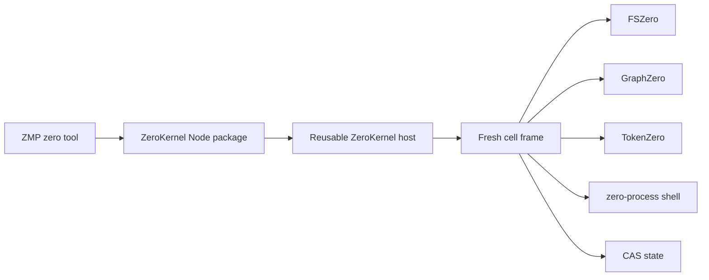

# ZeroStack

ZeroStack is the composition hub for three independent engines:

| Engine | Authority |
| --- | --- |
| [FSZero](https://github.com/AdityaVG13/fszero) | Live bytes, snapshots, bounded filesystem effects (`fz://`) |
| [GraphZero](https://github.com/AdityaVG13/graphzero) | Code structure, callers, impact, freshness (`gz://`) |
| [TokenZero](https://github.com/AdityaVG13/tokenzero) | Output measurement, projection, compaction, exact expansion (`tz://`) |

The engines never import one another. ZeroStack owns their shared ABI, typed references, CAS, process control, transactional coordination, and the in-process runtime that composes them.

## ZeroKernel

`ZeroKernel` is the only canonical execution product. It is a reusable in-process host with a fresh bounded JavaScript/TypeScript frame for every cell.



A cell sees direct typed methods on `z`; it does not route through command catalogs:

```js
const [source, callers] = await z.parallel([
  () => z.read("src/lib.rs"),
  () => z.asgrep("execute", { mode: "callers", path: "src" }),
]);
return { source, callers };
```

Core methods:

- filesystem: `z.read`, `z.snap`, `z.lookup`, `z.write`, snap-aware `z.edit`, `z.effect`, `z.remove`, `z.transact`
- structure: `z.asgrep` with typed structural modes
- output: `z.measure`, `z.project`, `z.compress`, structured `z.expand`
- orchestration: `z.parallel`, `z.pipeline`, `z.shell`
- durable state: `z.state.get`, `z.state.set`, `z.state.delete`, `z.state.list`

Every completed call returns one canonical response containing the outcome, visible value, event digest, CAS state evidence, and zero-live-resource ledger. File mutations are staged under one host-owned transaction per cell. Failed or cancelled frames reverse effects in receipt order and cannot publish staged filesystem effects or state.

## Rust host

```rust
use zero_abi::KernelBudget;
use zero_kernel::ZeroKernel;

let budget = KernelBudget {
    wall_ms: 30_000,
    cpu_ms: 30_000,
    memory_bytes: 256 * 1024 * 1024,
    call_limit: 64,
    task_limit: 16,
    output_byte_limit: 64 * 1024,
};
let kernel = ZeroKernel::canonical(root, store_root, session_id, budget)?;
let response = kernel.execute_cell("return await z.read('README.md');")?;
```

The host is reusable. `execute_cell` creates and destroys a fresh interpreter frame. `shutdown` cancels outstanding work and prevents new frames.

## Node package

Build the platform addon once, then load the package without a daemon, listener, worker pool, or runtime compilation:

```bash
rch exec -- cargo build --profile release-node -p zero-kernel-node
./scripts/build-node-prebuild.sh --stage-only
```

```js
const { ZeroKernel } = require("@zerostack/zero-kernel");

const kernel = new ZeroKernel({
  root: process.cwd(),
  sessionId: "example",
});
await kernel.initialize();
const response = await kernel.executeCell("return await z.read('README.md');");
await kernel.shutdown();
```

The package accepts `ZERO_KERNEL_NATIVE_ADDON=/absolute/path/to/zero_kernel_product.node` for development. Production packages use platform prebuilds and never compile or download at runtime.

## Operator CLI

The CLI is for diagnostics, direct stdin execution, and explicit store migration:

```bash
rch exec -- cargo build -p zero-kernel
./target/debug/zero-kernel doctor -C "$PWD"
printf '%s\n' 'return await z.read("README.md");' \
  | ./target/debug/zero-kernel exec -C "$PWD"
```

Legacy store import is offline and manifest-verified:

```bash
zero-kernel migrate \
  --source OLD_STORE \
  --destination NEW_STORE \
  --manifest migration.json \
  --key-hex 64_LOWERCASE_HEX_CHARACTERS
```

## ZMP integration

ZMP's built-in `zero` tool loads `@zerostack/zero-kernel` in-process and reuses a host per workspace/session/budget. Each tool call still receives a fresh frame. ZMP's `codemode` tool remains an independent fallback; ZeroKernel failures never execute the same source unsandboxed.

## Repository layout

| Path | Purpose |
| --- | --- |
| `crates/zero-kernel` | Canonical Rust host, frame lifecycle, transactions, state, shell |
| `crates/zero-kernel-node` | Asynchronous N-API binding |
| `crates/zero-codemode` | Bounded JS/TS interpreter used inside each frame |
| `crates/zero-abi` | Shared typed engine contracts and canonical response types |
| `crates/zero-store` | CAS and migration primitives |
| `crates/zero-process` | Verified child-process ownership and teardown |
| `bindings/node` | Published Node package loader, types, and prebuilds |

## Build topology

The canonical host links the three engine checkouts as sibling repositories:

```text
AI/
├── ZeroStack/
├── FSZero/
├── GraphZero/
└── TokenZero/
```

Use DSR for repository gates and RCH for narrow Cargo probes. Do not run workspace-wide Cargo tests.

## License

MIT
