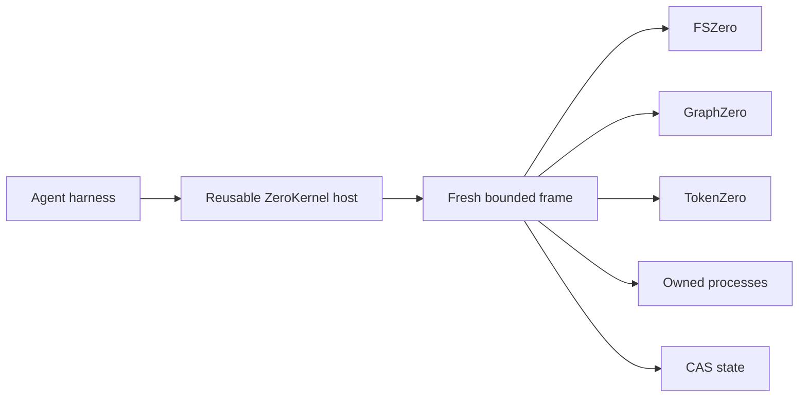

# ZeroStack

A daemonless, in-process agent kernel that composes filesystem, structure, and output authority behind six operations.

**Status:** active development · Rust 2024 · six operations · MIT

---

## TL;DR

### The problem

Agent harnesses often expose separate filesystem, search, shell, state, and compression catalogs. The model has to choose transports and operation families before it can do the work. Failed cells can also leave partial effects or live processes behind.

### The answer

ZeroKernel gives each cell one fresh JavaScript or TypeScript frame and one `z` global with exactly six operations: `read`, `find`, `edit`, `apply`, `run`, and `state`. ZeroStack composes three typed engines behind that surface and owns the transaction, cancellation, process, and response boundary.

> **Status:** ZeroStack is the source-only composition hub for the Zero family. It will not publish standalone releases. The six-operation surface is canonical under active dogfooding, while package and engine contracts may still change.

## What exists now

- A reusable Rust `ZeroKernel` host with a fresh bounded frame per cell.
- An asynchronous Node/N-API package for embedding the same host without a daemon or runtime compiler.
- Direct adapters for FSZero byte authority, GraphZero structural queries, and TokenZero output control.
- Cell-scoped filesystem transactions with rollback on failure, cancellation, state publication failure, or output publication failure.
- Owned process-tree cancellation and a terminal ledger that cannot report completion while resources remain live.
- Session-scoped CAS state for small JSON facts across otherwise fresh frames.

The engines never import one another. ZeroStack owns composition and the only model-facing execution surface.

## A complete turn in 30 seconds

Normal JavaScript provides orchestration. Independent calls use `Promise.all`; dependent work stays in the same bounded cell.

```javascript
const [source, callers] = await Promise.all([
  z.read("src/lib.rs"),
  z.find("execute_cell", { mode: "callers", path: "src" }),
]);

if (callers.items.length === 0) {
  return { source, decision: "No callers found" };
}

return { source, callers };
```

A normal UTF-8 file returns complete content. Large values return a bounded view plus an exact handle that `z.read` can recover later.

## What this repository owns

| Boundary | ZeroStack responsibility |
| --- | --- |
| Execution | Reusable host, fresh frame lifecycle, budgets, cancellation, and terminal outcomes. |
| Composition | Typed contracts joining the three engines without engine-to-engine imports. |
| Effects | One host-owned transaction per cell, staged publication, reverse-order restoration. |
| Processes | Validated working directories, bounded output, exact child-tree ownership and reaping. |
| State | Small session facts committed through CAS compare-and-set. |
| Response | One canonical outcome, value or error, exact handles, event, state evidence, and resource ledger. |

**Not owned here:** filesystem semantics belong to FSZero, structural truth belongs to GraphZero, and output economics belong to TokenZero.

## Four repositories, four authorities

| Repository | Authority | Visible through ZeroKernel |
| --- | --- | --- |
| **ZeroStack** | Composition, lifecycle, transactions, processes, durable state. | One bounded frame and one canonical response. |
| [FSZero](https://github.com/AdityaVG13/FSZero) | Bytes, snapshots, guarded file effects, exact restoration. | `z.read`, `z.edit`, `z.apply`. |
| [GraphZero](https://github.com/AdityaVG13/GraphZero) | Structure, relationships, freshness, blast radius. | `z.find`. |
| [TokenZero](https://github.com/AdityaVG13/TokenZero) | Measurement, projection, compression, exact expansion. | Automatic operation and response boundaries. |

## Architecture



The host retains initialized engine adapters and durable roots. A frame retains only one cell's interpreter values, promises, cancellation token, transactions, child processes, and staged state. Every terminal path destroys that frame.

ZeroKernel creates no listener, socket, daemon, idle worker, kernel child, or machine-wide service.

## Build and embed

ZeroStack currently builds from source with the four repositories checked out beside one another. The parent directory name and location are entirely up to you.

```bash
mkdir zerostack-workspace
cd zerostack-workspace
git clone https://github.com/AdityaVG13/ZeroStack.git
git clone https://github.com/AdityaVG13/FSZero.git
git clone https://github.com/AdityaVG13/GraphZero.git
git clone https://github.com/AdityaVG13/TokenZero.git
cd ZeroStack
```

### Rust host

```bash
cargo build -p zero-kernel
cargo test -p zero-kernel --test direct_host
```

### Node package

```bash
cargo build --profile release-node -p zero-kernel-node
./scripts/build-node-prebuild.sh --stage-only
```

```javascript
const { ZeroKernel } = require("@zerostack/zero-kernel");
const kernel = new ZeroKernel({ root: process.cwd(), sessionId: "example" });
await kernel.initialize();
const response = await kernel.executeCell(
  "return await z.read('README.md');"
);
await kernel.shutdown();
```

Production packages select an exact platform prebuild. They do not compile, download, or start a service at runtime.

## The six operations

| Operation | Contract |
| --- | --- |
| `z.read` | Read files, directories, snapshots, exact handles, and bounded selections. |
| `z.find` | Search text or structure; query definitions, references, callers, imports, paths, and semantics. |
| `z.edit` | Create, replace, remove, or patch one file with exact preimage guards. |
| `z.apply` | Apply atomic multi-file operations or a typed effect request. |
| `z.run` | Run one bounded process with owned cancellation and recoverable output. |
| `z.state` | Get, set, list, test, or delete small session-scoped JSON facts. |

There is no guest transaction method. Every mutation in a cell already shares the same host-owned transaction.

## One terminal response

```typescript
interface ZeroKernelResponse {
  protocol: "ZeroKernel";
  outcome: "Completed" | "Cancelled" | "Failed";
  value?: unknown;
  error?: { kind: string; detail: string; retryable: boolean };
  handles: string[];
  event: string;
  state: { before?: string; after?: string; unchanged: boolean };
  ledger: ResourceLedger;
}
```

A response cannot report completion while its frame still owns tasks or child processes. Completed output is the exact TokenZero projection recorded by the terminal event.

## Benchmarks

This reference run measures the current daemonless Node host with one initialization and a fresh bounded frame for every cell. It uses the packaged darwin-arm64 prebuild, Node.js v26.7.0, and 20 sequential measured runs after one warm-up.

| Measurement | p50 | p95 |
| --- | --- | --- |
| Host initialization | 21.867 ms | Single observation |
| Fresh no-op frame | 12.934 ms | 13.864 ms |
| Read 2,865-byte Cargo.toml | 20.728 ms | 21.229 ms |

Reference hardware: Apple M5 Max, 48 GB RAM. Source: `benchmarks/zero-kernel-reference.json`. Reproduce the same host lifecycle and fixtures with `node benchmarks/zero-kernel-reference.cjs`. The artifact retains every sample and reports the runtime, hardware class, method, and dropped-sample count.

### Verification lanes

| Area | Focused command |
| --- | --- |
| Host contract | `cargo test -p zero-kernel --test direct_host` |
| Frame syntax | `cargo test -p zero-codemode --test syntax` |
| Repository gate | `dsr quality --tool zerostack` |

These measurements describe one host and fixture. They do not claim cross-machine latency, throughput under concurrency, or memory use.

## Troubleshooting

Start with the terminal response rather than the visible symptom. Its outcome, structured error, event handle, state transition, and resource ledger describe which boundary failed and whether effects were committed, restored, or never admitted.

<details>
<summary><strong>A large read returned an outline instead of full text</strong></summary>

This is the normal large-value path, not truncation. ZeroKernel keeps the exact bytes in content-addressed storage and returns a bounded structural view plus an opaque handle. The view is intended for orientation: it identifies useful regions without pretending to be the file.

Pass the handle back to `z.read` for exact recovery, or request the required line or byte range. If the next step is an edit, use a structured read that returns a snapshot so the later `z.edit` carries the correct preimage. Never copy an outline into a write request; omitted regions would be lost.

</details>

<details>
<summary><strong>A structural query cannot access an absolute path</strong></summary>

`z.find` is confined to the configured workspace root because GraphZero's index, freshness guarantees, and coverage claims are meaningful only inside that boundary. An arbitrary absolute path has byte identity, but it does not automatically belong to the repository graph.

If the target is part of the project, configure the kernel root to include it. If it is an external file, use `z.read` for explicit byte access and do not infer definitions, callers, or certified absence from that read alone. Relative `..` escape remains rejected.

</details>

<details>
<summary><strong>A cell failed after writing files</strong></summary>

A write receipt means the effect was staged under the cell transaction; it does not mean the final state was published. Evaluation failure, cancellation, verification failure, state publication failure, or output publication failure can still trigger restoration.

Inspect the response outcome and terminal event. A failed or cancelled cell should show restoration in reverse receipt order and an unchanged durable state root. Do not manually undo files until you have checked that evidence, because a second reversal can reapply unwanted content. A completion ledger with live tasks or processes is a kernel defect.

</details>

<details>
<summary><strong>The Node package cannot find its addon</strong></summary>

The loader selects an exact prebuild for the current operating system and architecture. Failures usually mean the prebuild was not staged, the package was copied without `prebuilds/`, or the binary targets a different Node ABI or CPU.

For a source checkout, build `zero-kernel-node` with the documented profile and run `scripts/build-node-prebuild.sh --stage-only`. For development only, `ZERO_KERNEL_NATIVE_ADDON` may point to an explicit addon file. Production packages should ship the prebuild and should not compile or download one at runtime.

</details>

## FAQ

These answers focus on boundaries that affect harness design. ZeroKernel keeps model choices small while making byte identity, structural evidence, output projection, effects, and cleanup explicit inside the host.

<details>
<summary><strong>Why exactly six operations?</strong></summary>

The six operations describe the durable decisions an agent must make: retrieve data, locate relevant structure, change one file, apply a coordinated set, run a bounded process, and retain a small fact for the next frame. They avoid exposing transport names, engine catalogs, transaction opcodes, or projection internals.

Normal JavaScript handles composition. `Promise.all` expresses independent work, loops express bounded pipelines, and values connect dependent steps. Adding model-facing methods for every engine feature would create multiple ways to express the same action.

</details>

<details>
<summary><strong>Does a JavaScript variable survive the next cell?</strong></summary>

No. Variables, imports, closures, promises, and heap objects disappear at the terminal boundary. This prevents accidental cross-turn authority, stale handles hidden inside closures, and resource ownership that the host cannot attribute to one cell.

Use `z.state` for small facts such as a selected path, cursor, or user decision. Repository data belongs in files, and large or exact results belong behind handles. If a value must survive a host restart or be reviewed by humans, a file is usually the better authority.

</details>

<details>
<summary><strong>Can the engines import one another?</strong></summary>

No. FSZero, GraphZero, and TokenZero each own a different truth boundary and expose typed Rust contracts to the hub. The one-way dependency graph prevents filesystem behavior from depending silently on graph freshness or output projection from changing mutation semantics.

ZeroStack performs composition and remains responsible for ordering, cancellation, transactions, and the terminal response. Cross-engine behavior therefore has one place to audit instead of hidden cycles across three repositories.

</details>

<details>
<summary><strong>What happens when a cell is cancelled?</strong></summary>

The cancellation token reaches the interpreter, engine calls, concurrent promises, and owned process tree. ZeroKernel requests sibling cancellation, terminates exact children, waits for bounded settlement, restores staged effects and state, records one terminal event, and destroys the frame.

Cancellation is a distinct outcome, not a generic failure string. A retry receives a fresh frame and the last committed state root; it does not resume partially evaluated JavaScript.

</details>

<details>
<summary><strong>Why not expose each engine's complete catalog?</strong></summary>

Separate catalogs force the model to decide whether a task is filesystem, graph, or token work before it has enough evidence. They also expose overlapping read, search, expand, and batch concepts.

ZeroKernel keeps those decisions inside typed host routing. The model asks to read or find; the host selects byte retrieval, structural evidence, freshness repair, projection, and recovery. Operator CLIs may expose engine diagnostics without creating a second canonical model surface.

</details>

<details>
<summary><strong>Is the CLI the product surface?</strong></summary>

No. The reusable in-process host is the product surface. It retains initialized adapters and durable roots while creating a fresh bounded frame for each cell.

The CLI exists for health checks, one-cell stdin diagnostics, and offline migration. Its latency includes process startup and should not be presented as reusable-host latency. Production integrations should load the Rust or Node host directly.

</details>

## Contributing and security

Read `CONTRIBUTING.md` before changing engine contracts or the six-operation surface. Report vulnerabilities through `SECURITY.md`. Integration tests live under `tests/unit/<crate>/`; use the narrowest relevant test target.

## License

MIT.
