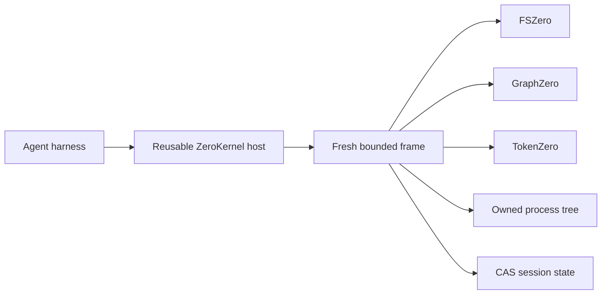

# Architecture

ZeroStack composes three independent engines behind one reusable in-process host. It does not merge their implementations and the engines never import one another.

## Authority boundaries

| Owner | Authority | ZeroKernel boundary |
| --- | --- | --- |
| ZeroStack | Host lifecycle, budgets, cancellation, transactions, processes, session state, terminal response | all six operations |
| FSZero | Exact bytes, snapshots, guarded file effects, restoration | `z.read`, `z.edit`, `z.apply` |
| GraphZero | Syntax, symbols, relationships, freshness, coverage | `z.find` |
| TokenZero | Measurement, projection, compression, exact expansion | automatic operation and response boundaries |

Authority is deliberately narrow. A graph result does not become file content. A compact output does not become the source bytes. A successful file receipt does not commit the cell by itself.

## Host and frame lifecycle

The host retains initialized adapters, durable roots, and session identity. Every call creates a fresh bounded JavaScript or TypeScript frame.

A frame owns its interpreter values, promises, cancellation token, staged filesystem transaction, child processes, and dirty state. Completion requires every owned resource to settle. The frame is then destroyed whether the outcome is completed, failed, or cancelled.

ZeroKernel opens no network listener and starts no machine-wide daemon. Embedding applications load the Rust host or the asynchronous Node binding in-process.

## Effects and publication

The first file mutation lazily opens one cell transaction. FSZero returns exact preimages and typed receipts. A completed cell publishes its effects and successor state root at the terminal boundary. Failure, cancellation, verification failure, state publication failure, or output publication failure restores receipts in reverse order and leaves the prior state root authoritative.

`z.edit` changes one file. `z.apply` changes an atomic set. Normal JavaScript expresses orchestration, so the guest surface does not expose a second transaction language.

## Structural evidence

`z.find` routes text, AST, symbol, relationship, call-path, and semantic modes through GraphZero. Freshness repair and coverage remain engine responsibilities. A no-result answer supports absence only when its scope, parser coverage, and snapshot are sufficient.

## Output and recovery

TokenZero measures the serialized value at operation and response boundaries. Small values pass through. Larger values may return a bounded projection and exact handles. Recovering a handle returns original bytes and contributes to recovery-aware accounting.

## Process ownership

`z.run` belongs to the hub. It validates the working directory, starts the exact child tree, captures bounded output, and terminates and reaps descendants on timeout, cancellation, frame failure, shutdown, or object destruction. TokenZero projects captured output but never owns the process lifecycle.

## Source and release model

ZeroStack is source-only and does not publish standalone releases. FSZero, GraphZero, and TokenZero are the released products. Once coordinated releases begin, the engines will share one version to signal compatible contract parity.
