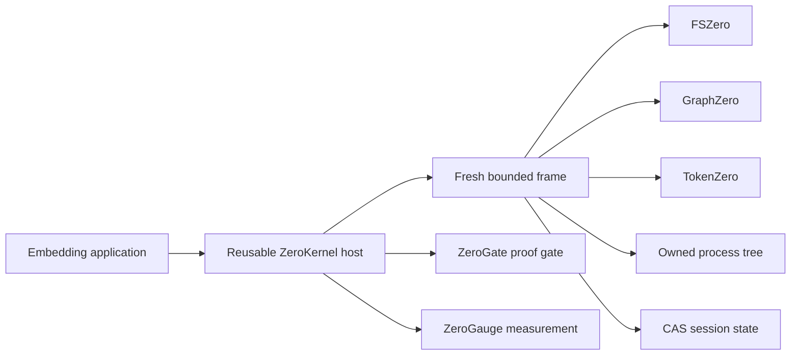

# Architecture

ZeroStack is one product. It composes three independent domain libraries behind one reusable in-process host. The hub lives under `crates/zerostack/`; the files, structure, and tokens domains live under `crates/fszero/`, `crates/graphzero/`, and `crates/tokenzero/`. The domains never import one another. ZeroGate and ZeroGauge are hub features, not independent products.

ZeroStack is harness-agnostic and can be embedded by any compatible caller.

## Authority boundaries

| Owner | Authority | ZeroKernel boundary |
| --- | --- | --- |
| ZeroStack | Host lifecycle, budgets, cancellation, transactions, processes, session state, terminal response | all six operations |
| FSZero | Exact bytes, snapshots, guarded file effects, restoration | `z.read`, `z.edit`, `z.apply` |
| GraphZero | Syntax, symbols, relationships, freshness, coverage | `z.find` |
| TokenZero | Measurement, projection, compression, exact expansion | automatic operation and response boundaries |
| ZeroGate | Proof-carrying exact scenario closure and read-only Snap-to-File decisions | `z.read({snapToFile: ...})` after trusted GraphZero evidence registration |
| ZeroGauge | Paired native/Zero measurements and exact savings reports | Rust host API and `zero-kernel savings-report` |

Authority is deliberately narrow. A graph result does not become file content. A compact output does not become the source bytes. A successful file receipt does not commit the cell by itself.

## Host and frame lifecycle

The host retains initialized adapters, durable roots, and session identity. Every call creates a fresh bounded JavaScript or TypeScript frame.

A frame owns its interpreter values, promises, cancellation token, staged filesystem transaction, child processes, and dirty state. Completion requires every owned resource to settle. The frame is then destroyed whether the outcome is completed, failed, or cancelled.

ZeroKernel opens no network listener and starts no machine-wide daemon. Embedding applications load the Rust host or the asynchronous Node binding in-process.

## Effects and publication

The first file mutation lazily opens one cell transaction. FSZero returns exact preimages and typed receipts. A completed cell publishes its effects and successor state root at the terminal boundary. Failure, cancellation, verification failure, state publication failure, or output publication failure restores receipts in reverse order and leaves the prior state root authoritative.

`z.edit` changes one file. `z.apply` changes an atomic set. Normal JavaScript expresses orchestration, so the guest surface does not expose a second transaction language.

## Structural evidence

`z.find` routes text, AST, symbol, relationship, call-path, and semantic modes through GraphZero. Freshness repair and coverage remain engine responsibilities. A no-result answer supports absence only when its scope, parser coverage, and snapshot are sufficient.

## Proof-carrying Snap-to-File

The trusted embedding host registers a validated `GraphZeroCompletenessInput` with `ZeroKernel::register_snap_to_file_completeness`. The returned opaque handle is valid only for that kernel instance. A cell can then pass that handle in `z.read({snapToFile: {...}})`. Guest-authored completeness envelopes are rejected, so a model cannot manufacture a proved closure.

ZeroGate returns a snapped, escaped, or refused packet. A snapped packet carries the exact first expansion and a read-only continuation handle. Unknown coverage escapes to the declared native baseline. Unsafe demand is refused. This path never gains file-edit authority and does not add a seventh `z.*` operation.

## Output and recovery

TokenZero measures the serialized value at operation and response boundaries. Small values pass through. Larger values may return a bounded projection and exact handles. Recovering a handle returns original bytes and contributes to recovery-aware accounting.

ZeroGauge reports token savings only from explicit paired observations with the same task, machine fingerprint, and measurement kind. Reports carry exact token, byte, and call numerators and denominators. Missing or incomparable observations fail closed; zero denominators and negative savings remain explicit unknown results. `paired_savings_report` exposes the Rust API, and `zero-kernel savings-report --native <native.json> --zero <zero.json>` emits its canonical report. ZeroKernel never invents the native baseline.

## Zero-miss speculative scheduling

ZeroKernel admits speculative work only after `CellPreparation` seals the full
source and a rooted verifier proves an unconditional node in the exact
execution DAG. The permit binds the Work Capsule, state, contract, source,
DAG, node, inputs, epoch, arguments, occurrence, cancellation bound, work
budget, and provider-token budget.

Only `z.read`, `z.find`, and named certified-pure extensions are eligible.
`z.edit`, `z.apply`, `z.run`, and `z.state` remain ordinary, dependency-ordered
operations. Capacity refusal chooses ordinary execution before launch. Once a
speculative call is admitted, the exact call must claim that result; a missing
claim is an invariant failure and never triggers a duplicate call.

Cancellation drains and joins unclaimed work. The speculation ledger records
claimed work and conservative provider-token waste. Speculation is a latency
optimization and is not counted as token savings. A
`find -> exact snap -> edit -> verify` workflow still fits in one model-facing
`zero` call, with intermediate evidence kept behind exact handles.

## Live Pareto decisions

TokenZero computes the live Pareto frontier from fresh, verifier-bound candidates. Candidate identity, semantic and adapter roots, protected outcomes, resource coordinates, verifier identity, and evidence freshness are part of the decision digest. Stale, missing, unknown, or incomparable candidates remain visible and cannot dominate another candidate. ZeroStack consumes the typed decision without translating it into a second frontier model.

## Atomic effect settlement

The direct host can prepare, validate, stage, and commit one effect request in one call. The call binds source, Work Capsule roots, policy/contract coordinate, state-before root, and exact receipts. Receipt validation runs before state or transaction commit. Cancellation and binding drift retain the live transaction for the single rollback authority; rollback failure becomes a corrupt outcome rather than a successful cancellation. Completed responses carry the exact committed receipts and state root from the same settlement.

## Process ownership

`z.run` belongs to the hub. It validates the working directory, starts the exact child tree, captures bounded output, and terminates and reaps descendants on timeout, cancellation, frame failure, shutdown, or object destruction. TokenZero projects captured output but never owns the process lifecycle.

## Source and release model

ZeroStack currently ships only as source in this workspace. There is no tagged ZeroStack release and no Homebrew, npm, or Pi package to install. FSZero, GraphZero, and TokenZero are internal crate domains in the same Cargo workspace and set `publish = false`; they are not separately published products. The only executable target for product operations is `zero-kernel`, whose subcommands include runtime diagnostics, Program evidence assembly, and paired savings reporting.

Split complex functions along existing authority and lifecycle boundaries rather than adding compatibility wrappers.
