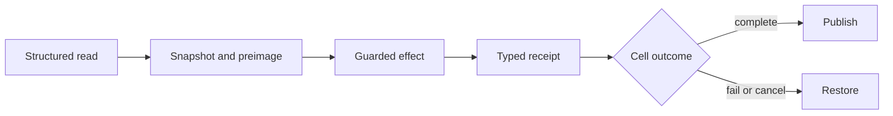

# Files domain architecture

FSZero owns exact bytes and filesystem effects. It supplies typed engine methods to ZeroKernel. It is not an installable product and has no product CLI.

## Layers

```text
zero-fs            typed file adapter and guarded effect execution
fszero-store        content-addressed recovery, journals, durable publication
fszero-core         paths, refs, edit specifications, and shared domain types
```

There is no engine-local model planner. ZeroStack owns JavaScript evaluation, orchestration, transaction timing, cancellation, and the terminal response.

## Read authority

Small UTF-8 files can return complete content. Larger results return a bounded view plus an exact handle. A structured read may bind path, selected range, exact preimage, offsets, continuation metadata, and recovery identity. A view is never authority for omitted bytes.

## Path policy

Workspace-relative paths remain inside the configured root. Relative parent escape is rejected. Explicit absolute paths may be used for byte-authority work when permitted, but they are not structural graph inputs.

## Effects

Every mutation is guarded by exact preimage or absence authority. FSZero returns a typed receipt identifying what changed and how to restore it.



`z.edit` changes one file and `z.apply` changes an atomic set. ZeroStack decides the terminal outcome; FSZero remains authoritative for byte identity and reversal.

## Recovery and separation

Exact payloads are content-addressed and recovered through `z://blob/` handles. A handle proves identity, not global availability. Durable publication fails closed. GraphZero owns structural relationships and TokenZero owns model-visible projection.

## Release model

FSZero, GraphZero, and TokenZero are domain libraries in the ZeroStack workspace, not separately released products. ZeroStack currently ships from source only.
