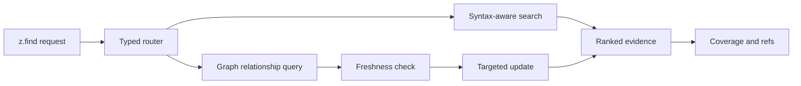

# GraphZero architecture

GraphZero owns repository structure, relationship evidence, index freshness, coverage, and blast radius. It supplies a typed engine adapter to ZeroKernel. It is not an installable product and has no product CLI. Indexing happens inside `z.find` through the structural engine.

## Crate layers

```text
zero-graph          typed structural-engine facade consumed by ZeroKernel
graphzero-engine     internal query, impact, and evidence library
graphzero-store      snapshots, indexes, refs, and durable graph data
graphzero-extract    language extraction and syntax evidence
graphzero-types      public domain types and stable errors
```

`graphzero-reserve` adds intent coordination and `graphzero-coverage` certifies freshness and absence claims. There is no engine-local JavaScript planner. ZeroStack owns cell evaluation and orchestration.

## Query routing

`z.find` selects natural, pattern, literal, word, regex, import, definition, symbol, reference, caller, callee, call-path, or semantic behavior.



Results include symbol identity, snapshot, freshness, scope, coverage, truncation, and continuation. Those fields determine whether a caller may narrow the reading set or claim that a relationship is absent.

## Snapshots and freshness

A published snapshot binds nodes and edges to repository state. File changes invalidate affected evidence. GraphZero repairs the relevant scope before treating an answer as current. Cold indexing may return a retryable outcome rather than consume the host deadline.

## Coverage and absence

No result is not automatically absence. A defensible claim requires a resolved query, current snapshot, parser and language coverage for the named scope, and no truncation that hides possible matches. Generated code, macros, reflection, dynamic loading, unsupported languages, and external packages remain explicit boundaries.

## Blast radius

Callers answer one relationship. Blast radius starts from edit intent and combines callers, imports, dependencies, likely tests, recent changes, and silent-risk signals. It prioritizes verification; it does not promise that every returned file will break.

## Exact evidence

Large result sets may stay behind `z://blob/` refs. A ref identifies evidence but does not make source bytes authoritative. FSZero owns exact file content and snapshots. TokenZero controls model-visible projection and recovery-aware accounting.

## Release model

FSZero, GraphZero, and TokenZero are domain libraries in the ZeroStack workspace, not separately released products. ZeroStack currently ships from source only.
