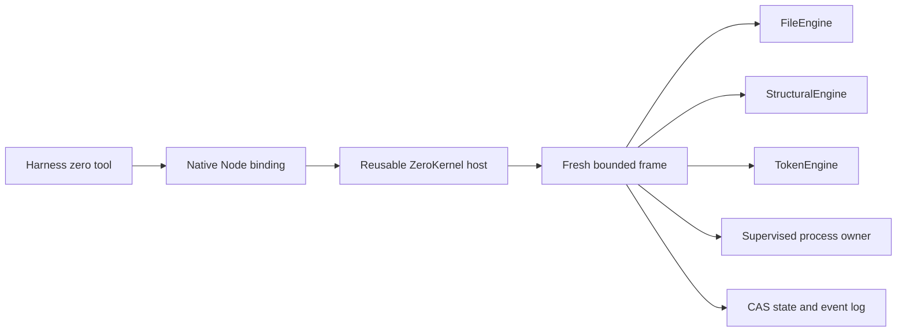

# ZeroKernel

**Status:** Canonical runtime architecture  
**Scope:** ZeroStack, ZMP, OMP, Pi-compatible harnesses

ZeroKernel is the only canonical model-facing ZeroStack execution surface. It is a daemonless, reusable in-process host that creates a fresh bounded JavaScript or TypeScript frame for every cell.

FSZero owns bytes and filesystem effects. GraphZero owns structural queries and index freshness. TokenZero owns measurement, projection, compression, and exact expansion. These engines do not import one another. ZeroStack composes their typed Rust contracts.

## Architecture



The host retains initialized engine adapters and durable CAS roots. A frame retains only one cell's interpreter values, transactions, promises, cancellation token, child processes, and staged state. Every terminal path destroys the frame.

ZeroKernel does not create a listener, socket, daemon, idle worker, kernel child, or machine-wide service.

## Direct guest surface

A cell receives one `z` global with exactly six operations. Calls map directly
to typed host methods; the model does not select an engine, transport,
operation registry, or compatibility profile.

```typescript
interface ZeroKernelSurface {
  read(
    target: string | ReadSnapshotRequest | ReadSnapshot,
    options?: ReadOptions | LookupOptions | ExpandOptions,
  ): Promise<string | string[] | ReadSnapshot | ExpandResult>;
  find(query: string | FindRequest, options?: FindOptions): Promise<FindResult>;
  edit(
    target: string | ReadSnapshot,
    patch: ExactPatch | CreatePatch | RemovePatch | ReplaceFilePatch,
  ): Promise<FileEffectReceipt>;
  apply(request: ApplyOperation[] | EffectRequest): Promise<EffectResult>;
  run(command: string | string[], options?: RunOptions): Promise<RunResult>;
  state: {
    get<T>(key: string): T | undefined;
    set<T>(key: string, value: T): void;
    has(key: string): boolean;
    delete(key: string): boolean;
    list(): string[];
  };
}
```

Normal JavaScript supplies orchestration. Use `Promise.all` for independent
calls and loops or array methods for staged pipelines. Every mutation in a
cell already shares one transaction, so there is no guest transaction method.
TokenZero measurement, projection, compression, and exact recovery run
automatically at operation and response boundaries.

## File turn law

A normal UTF-8 file within the inline byte limit returns complete content from
`z.read`. A directory path returns a bounded deterministic listing.

A larger file returns a bounded structural outline plus an opaque
`z://blob/<digest>` handle. Passing that handle back to `z.read` recovers exact
text. Selector options return exact byte or line ranges with offsets,
completion, and continuation metadata. A structured `z.read` request can bind
a search, selection, or decision view and returns a snapshot object whose
exact handle is accepted by later `z.read` and `z.edit` calls.

## Structural queries

`z.find` is the single structural entry point. Its mode selects natural,
pattern, word, literal, regex, imports, definitions, symbols, references,
callers, callees, call path, or semantic behavior.

Natural, pattern, and semantic modes use embedded ast-sgrep and Tree-sitter.
Relationship modes use GraphZero's typed query router. Index construction and
freshness repair happen inside GraphZero without a daemon or model-facing
index command.

### External paths

Absolute paths are byte-authority only through `z.read` and `z.edit`. They are
never indexed or structurally queried. `z.find` remains root-confined.
Relative `..` escape is rejected.

## Atomic effects

Every file mutation lazily opens one host-owned transaction for the cell.
FSZero supplies an exact lease, typed effect receipt, preimage handle, and
restoration operation.

A completed cell commits only at its terminal boundary. A failed or cancelled
cell restores applied effects in reverse receipt order. Projection or state
publication failure also rolls back file effects and leaves the prior durable
state root authoritative.

`z.edit` handles one file. `z.apply` handles atomic multi-file changes, exact
preimage or absence guards, optional bounded verification, and internal
rollback. A snapshot returned by structured `z.read` carries the preimage used
by a later `z.edit`.

## Cancellation and quiescence

One cancellation token reaches the interpreter, engine calls, concurrent promises, and the owned process tree.

On failure or cancellation, ZeroKernel:

1. requests sibling cancellation;
2. terminates the exact owned child tree;
3. waits for the frame's task and process counters to reach zero within a bounded settlement window;
4. rolls back staged effects and state;
5. publishes one terminal event;
6. destroys the frame.

A response cannot report completion while that frame still owns tasks or child processes.

## Process ownership

`z.run` is implemented by ZeroStack's process layer, not TokenZero. It accepts
script or argv form, validates the working directory, captures bounded stdout
and stderr, asks TokenZero to project combined output, and preserves an exact
handle when projection omits bytes.

Timeout, abort, frame failure, host shutdown, and object destruction all
signal and reap the exact owned process tree.

## Durable state

`z.state` is a bounded session-scoped JSON map for small facts that must
survive fresh interpreter frames. Good uses include a selected path, a cursor,
a workflow checkpoint, or a user decision needed by the next cell. It is not
repository data, a cache for large results, a secret store, or a replacement
for files and opaque handles.

The current limits are 64 keys, 128 bytes per key, 4 KiB per value, and 16 KiB
total. The host hydrates state from the session's committed CAS root before
evaluation. A completed dirty cell commits one successor root with
compare-and-set semantics. Failed and cancelled cells leave the prior root
unchanged.

Interpreter heap objects, imports, variables, and promises never persist
across cells.

## Canonical response and event log

Every accepted cell returns one `ZeroKernelResponse`:

```typescript
interface ZeroKernelResponse {
  protocol: "ZeroKernel";
  outcome: "Completed" | "Cancelled" | "Failed";
  value?: unknown;
  error?: { kind: string; detail: string; retryable: boolean };
  handles: string[];
  event: string;
  state: { before?: string; after?: string; unchanged: boolean };
  ledger: ResourceLedger;
}
```

The response's event handle resolves to the append-only terminal record. Completed output is the exact TokenZero projection recorded by that event. Failed and cancelled output is the exact structured error detail whose digest the event records. Harnesses must not add unlogged model-visible prefixes or compatibility envelopes.

## Rust and Node hosts

The Rust package is `zero-kernel`. Its `ZeroKernel::canonical` constructor links the three typed engine adapters.

The Node package is `@zerostack/zero-kernel`. It exports an asynchronous N-API class with:

- `initialize()`
- `executeCell(source, signal?)`
- `status()`
- `shutdown()`

The package selects an exact platform prebuild or the explicit `ZERO_KERNEL_NATIVE_ADDON` development path. It never builds, downloads, or starts a service at runtime.

ZMP embeds the native package through `@oh-my-pi/zerostack-runtime`. The built-in `zero` tool calls `executeCell` and reuses one host per workspace, session, and budget. ZMP's `codemode` tool remains a separate fallback. A ZeroKernel failure never reruns the same source unsandboxed.

## Operator surface

The `zero-kernel` CLI is outside the model path:

- `doctor` and `health` initialize the canonical composition and report roots and live-resource counters;
- `exec` runs one stdin cell for diagnostics;
- `migrate` imports a frozen legacy SHA-256 store into BLAKE3 CAS and emits a signed manifest.

Migration is offline. Operators freeze writers, snapshot the source store, run the importer, verify every source and destination digest plus manifest signature, switch the harness root, and retain the snapshot until a restore drill passes.

## Noncanonical surfaces

The retired `zsx`, `zsx-core`, and `zsx-node` composition layers are not workspace members or package exports. Standalone per-engine CodeMode and MCP wrappers are not canonical execution paths. Git history and internal migration records preserve their provenance.

Foundation contracts and explicit compatibility packages may remain for non-model conformance, but they must not register a second model-facing catalog beside ZeroKernel.

## Verification requirements

ZeroStack itself is not a published release. A shipped harness or engine
that embeds ZeroKernel must attach current evidence for:

- direct runtime lifecycle and terminal outcomes;
- normal and large file turn behavior;
- event-visible byte equality;
- transaction rollback and state-root preservation;
- real parallel overlap and pipeline stage ordering;
- structural search plus freshness repair;
- shell timeout, cancellation, exact output, and zero live resources;
- Node package loading, lifecycle, durable state, and cancellation;
- ZMP primary `zero` routing and independent `codemode` fallback;
- offline migration and restore.

Performance numbers require a named host, exact command, corpus, sample count, and observed distribution. This specification makes no unmeasured latency, memory, or compression claim.
