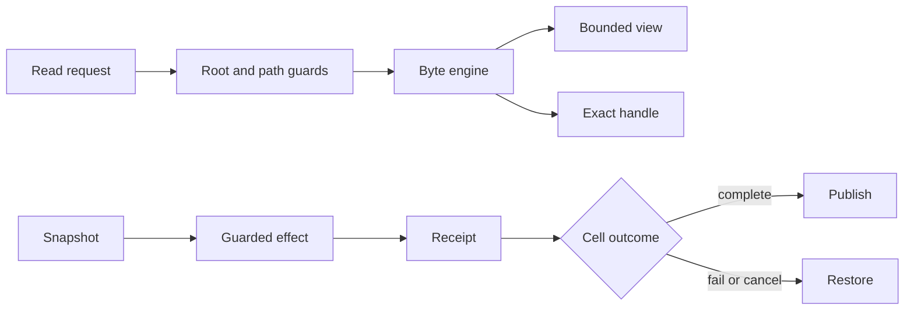

# FSZero

The byte and filesystem authority for exact reads, snapshots, atomic effects, and recovery.

**Status:** active development · local-first · exact recovery · MIT

---

## TL;DR

### The problem

Agents need exact bytes, but large reads and filesystem effects are expensive to carry in context and dangerous to apply without a preimage. A failed multi-step cell must not leave the tree half changed.

### The answer

FSZero supplies byte authority to ZeroKernel: bounded reads with exact handles, structured snapshots, guarded single-file edits, atomic multi-file effects, typed receipts, and exact restoration.

> **Status:** FSZero builds from source and is being hardened as the filesystem engine behind ZeroKernel. Coordinated engine releases are planned, but parity with GraphZero and TokenZero is not claimed until those releases begin.

## What exists now

- Root-confined reads, listings, metadata, text search, and structured snapshot requests.
- Content-addressed `fz://` handles for exact payload recovery without keeping bulk bytes visible.
- Guarded create, replace, remove, and patch effects with exact preimage or absence checks.
- Atomic multi-file application with internal rollback and typed receipts.
- Speculative edit worlds, mutation history, and undo in the standalone product surface.
- A local per-user recovery index and opt-in watch-mode incremental indexing.

FSZero treats identity, preimages, and restoration as first-class data. A compact view never becomes the authority for the bytes it represents.

## A complete turn in 30 seconds

Read a structured snapshot, then edit against the exact preimage carried by that snapshot.

```javascript
const snapshot = await z.read({
  path: "src/config.rs",
  select: { lines: [18, 42] },
  snapshot: true,
});

return await z.edit(snapshot, {
  exact: {
    old: "const RETRIES: usize = 2;",
    new: "const RETRIES: usize = 3;",
  },
});
```

If another writer changes the file after the snapshot, the edit conflicts instead of overwriting unseen work.

## What this repository owns

| Owns | Meaning |
| --- | --- |
| Bytes | Exact file content, bounded views, and content identity. |
| Snapshots | A recoverable selection plus the exact preimage needed by a later effect. |
| Path policy | Workspace confinement, validated external byte access, and refusal of relative root escape. |
| Effects | Guarded file mutations, typed receipts, and restoration operations. |
| Atomic sets | Multi-file application with all-or-nothing publication. |
| Recovery | Exact handles, journals, worlds, and undo where the surface enables them. |

**Not owned here:** code relationships and freshness belong to GraphZero. Output projection and token accounting belong to TokenZero. Cell lifecycle and commit timing belong to ZeroStack.

## Where FSZero fits

| ZeroKernel operation | FSZero role |
| --- | --- |
| `z.read` | Resolve paths, directories, snapshots, selectors, and exact handles. |
| `z.edit` | Apply one guarded file effect and return a typed receipt. |
| `z.apply` | Apply an atomic set of file operations with rollback. |
| `z.find` | FSZero may supply byte retrieval, but GraphZero owns structural truth. |

ZeroStack decides when a cell commits. FSZero supplies the lease, preimage, effect, receipt, and inverse needed to make that decision safe.

FSZero, GraphZero, and TokenZero are the released products in the family. Once coordinated releases begin, all three engines will publish the same version to signal contract parity. ZeroStack remains source-only and is not part of that version sequence.

## Architecture



Large values stay in the local content-addressed store. Model-visible output carries a bounded representation and a handle. Mutations preserve enough preimage evidence to restore the exact prior state.

The byte engine does not decide whether the whole cell succeeds. It returns typed evidence to ZeroStack: what object was read, which preimage guarded the effect, what changed, and how to reverse it. That lets the host coordinate file publication with state, output, cancellation, and sibling-engine work without weakening filesystem authority.

## Build from source

```bash
git clone https://github.com/AdityaVG13/fszero
cd fszero
cargo build --release -p fszero-cli
```

`rust-toolchain.toml` pins the required nightly toolchain. Contributors can build focused packages; the ZeroKernel composition links FSZero as a sibling checkout.

### Standalone operator checks

```bash
  # <!-- audit:skip --> binary is produced by the preceding cargo build
./target/release/fszero doctor --json
python3 scripts/readme_command_audit.py
```

The standalone CLI remains useful for diagnostics, batch work, worlds, history, and recovery inspection. New agent-runtime integrations should use the ZeroKernel engine contract rather than register a second model-facing catalog.

## Read, decide, apply, recover

1. **Read.** Return complete small files or a bounded view plus an exact handle.
2. **Bind.** A structured read returns a snapshot carrying selection and preimage evidence.
3. **Decide.** The model operates on the visible view without losing access to source bytes.
4. **Apply.** One file uses `z.edit`; an atomic set uses `z.apply`.
5. **Publish or restore.** ZeroStack commits at the cell boundary or asks FSZero to reverse receipts.

### Atomic multi-file example

```javascript
return await z.apply([
  { path: "src/lib.rs", replace: { old: "mod old;", new: "mod core;" } },
  { path: "src/core.rs", create: "pub fn run() {}\n", requireAbsent: true },
]);
```

## Benchmarks

The committed benchmark artifact describes FSZero's standalone process shapes. Values below are evidence for that artifact, not universal machine claims.

| Measurement | Reference result | Process model |
| --- | --- | --- |
| Corpus | 265 files, 19.56 MB | Reference workspace | <!-- claim:benchmarks/demo-bench_results.json#corpus.files --> <!-- claim:benchmarks/demo-bench_results.json#corpus.bytes -->
| Cold full index | 434.46 ms, 5 runs | Spawn, store cleared | <!-- claim:benchmarks/demo-bench_results.json#results.cold_full_index_ms -->
| Warm read | 0.182 ms p50, 1.337 ms p95 | Long-lived standalone session | <!-- claim:benchmarks/demo-bench_results.json#results.warm_read_p50_ms --> <!-- claim:benchmarks/demo-bench_results.json#results.warm_read_p95_ms -->
| Warm search | 0.625 ms p50 | Long-lived standalone session | <!-- claim:benchmarks/demo-bench_results.json#results.search_p50_ms -->
| World create-to-commit | 9.01 ms | Scratch repository | <!-- claim:benchmarks/demo-bench_results.json#results.worlds_new_commit_cycle_ms -->
| History plus undo | 16.86 ms | Spawned CLI invocations | <!-- claim:benchmarks/demo-bench_results.json#results.history_undo_roundtrip_ms -->

Reference hardware: Apple M5 Max, 48 GB RAM. Source: `benchmarks/demo-bench_results.json`. Compare rows only when their process model matches.
Artifact date: `2026-07-10T04:18:34Z`. Benchmark commit: `ed60f85ba390`.

```bash
./scripts/benchmark.sh
```

## Local data and telemetry

FSZero is local-first. Shareable usage telemetry is off by default and has no exporter. When explicitly enabled, the usage file records only `execution_path`, `raw_tokens`, and `spent_tokens`.

Set `FSZERO_TELEMETRY=1` only when you want the local usage ledger. Exact file payloads and recovery objects remain local.

The telemetry ledger does not contain file bodies, search hits, snapshots, or edit preimages. Those objects live in the recovery store under its filesystem permissions and retention policy. Disabling telemetry stops new usage rows; it does not delete recovery data needed to expand existing refs or restore effects.

## Troubleshooting

Filesystem failures should be diagnosed from identity and receipts, not from what the file happens to contain when you look later. Record the path, snapshot or preimage handle, effect receipt, and terminal outcome before retrying. Those four pieces distinguish a legitimate conflict from a failed restoration or a path-policy error.

<details>
<summary><strong>A write reports a preimage conflict</strong></summary>

The file changed after the read that produced your snapshot. FSZero compares the expected preimage with current byte authority and refuses to overwrite content you have not seen. This can come from another agent, an editor, a formatter, or a generated-file step.

Re-read the file, review the intervening change, and construct a new effect against the new snapshot. If both edits are valid, merge them explicitly. Do not remove the guard or replace the whole file from stale text; that converts a safe conflict into silent data loss. Repeated conflicts usually mean ownership needs coordination rather than a larger retry loop.

</details>

<details>
<summary><strong>A large file did not arrive inline</strong></summary>

FSZero returned a bounded view because carrying the complete payload would exceed the operation's inline budget. The exact object remains in the local content-addressed store, and the response should include the handle and enough continuation or selection metadata to request the next useful region.

Use `z.read` with the handle for exact recovery, or request a line or byte selector. Prefer the smallest range that answers the current question, but recover the full file before a whole-file rewrite. A structural outline, search preview, or truncated display is never a valid replacement preimage.

</details>

<details>
<summary><strong>A path escapes the workspace root</strong></summary>

Relative `..` escape is rejected before filesystem dispatch. This keeps a cell's default authority tied to its configured project instead of letting an innocent-looking relative path drift into a parent checkout or home directory.

Use a path inside the root whenever the file participates in repository work. Absolute paths are accepted only by explicit byte-authority operations and remain outside structural indexing. If the root itself is wrong, fix the host configuration rather than normalizing escape paths in application code.

</details>

<details>
<summary><strong>The local store cannot open</strong></summary>

Run the FSZero doctor command with JSON output and inspect the reported store root, permissions, lock state, and recovery diagnostics. Common causes include an unwritable parent directory, a stale lock from an unclean process exit, filesystem damage, or a configuration that points several sessions at an incompatible store.

FSZero fails closed because silently switching stores would break handle recovery and preimage authority. `FSZERO_ALLOW_EPHEMERAL=1` is an explicit operator escape hatch for disposable work; it does not repair the durable store and any refs minted there may disappear with the process. Preserve the original store before attempting repair or migration.

</details>

## FAQ

FSZero's core idea is simple: visible text is a working view, while exact bytes and effect receipts remain authoritative. The distinctions below matter when a harness needs to recover content, coordinate writers, or prove that a failed cell left the tree unchanged.

<details>
<summary><strong>Why keep an exact handle if the visible text looks sufficient?</strong></summary>

The current question may only need an outline or selected range, but the next decision can depend on a detail outside that view. Without a stable handle, the agent must issue a broad re-read and hope the file has not changed, or fill the gap from memory.

The handle preserves content identity independent of presentation. It enables exact expansion, comparison, and restoration while TokenZero controls how much is visible now. Keeping identity separate from display is what makes aggressive context reduction safe.

</details>

<details>
<summary><strong>What is the difference between a snapshot and a handle?</strong></summary>

A handle identifies an exact stored object. It answers “which bytes?” and can be expanded wherever the configured recovery store can verify that object.

A snapshot adds operation context: path, selected region, offsets, and the preimage needed by a guarded later edit. Use a handle when you need recovery. Use a snapshot when a read is part of a read-modify-write sequence and the mutation must fail if authority changes.

</details>

<details>
<summary><strong>Does FSZero choose when a transaction commits?</strong></summary>

No. FSZero supplies leases, guarded effects, receipts, and restoration operations. ZeroStack owns the cell lifecycle and decides whether staged work becomes authoritative at the terminal boundary.

This division lets FSZero remain correct for bytes while the hub coordinates state publication, output projection, cancellation, and sibling engines. A file effect that succeeded locally can still be restored if another terminal requirement fails.

</details>

<details>
<summary><strong>How are atomic effects different from speculative worlds?</strong></summary>

An atomic effect set protects one bounded publication: either every guarded operation applies or the set is restored. It is the right mechanism for a known multi-file change inside one cell.

A speculative world is a longer-lived alternate view used to explore or review changes before exporting them to the real tree. Worlds, history, and undo belong to FSZero's standalone operator workflows. ZeroKernel's normal model path uses cell transactions rather than asking the model to manage worlds.

</details>

<details>
<summary><strong>Do `fz://` refs work on another machine?</strong></summary>

A ref carries content identity, not the bytes themselves. Another process can expand it only if it can reach a compatible store containing that object and verify the digest. Copying the ref string alone does not publish the payload.

For portable transfer, move the underlying object through an explicit export or store-sharing mechanism and verify it at the destination. Non-blob operational refs can also depend on local manifests or indexes and should not be advertised as universally portable.

</details>

<details>
<summary><strong>Can I still use the standalone CLI?</strong></summary>

Yes. The CLI is useful for diagnostics, batch operations, worlds, history, undo, and FSZero-only inspection. Those are operator workflows where explicit engine concepts are appropriate.

For a model that also needs structural evidence and output control, use ZeroKernel. Registering both the standalone agent catalog and ZeroKernel in one session creates overlapping ways to read and mutate files, which weakens traces and makes ownership harder to reason about.

</details>

## Contributing and security

See `CONTRIBUTING.md` for the focused build and verification loop. Report vulnerabilities through `SECURITY.md`. Benchmark changes must update the committed artifact and pass the claims audit.

## License

MIT. See `LICENSE`.
