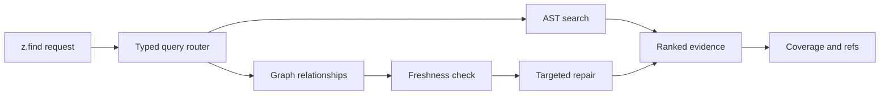

# GraphZero

The structure authority for code search, callers, impact, freshness, and certified absence.

**Status:** 0.1.0 · active development · Tree-sitter · freshness repair · MIT

---

## TL;DR

### The problem

Text search finds matching bytes but cannot, by itself, establish definitions, callers, imports, dependency paths, freshness, or that an expected relationship is absent. Agents then open too many files or miss break sites.

### The answer

GraphZero owns structural truth behind `z.find`. It combines syntax-aware search with a typed repository graph, repairs freshness inside the engine, returns compact evidence, and distinguishes “no match” from “not covered.”

> **Status:** GraphZero 0.1.0 is in active development. Published latency claims come from committed artifacts. Coordinated engine releases are planned, but parity with FSZero and TokenZero is not claimed until those releases begin.

## What exists now

- Natural, AST-pattern, literal, word, regex, import, definition, symbol, reference, caller, callee, call-path, and semantic modes.
- A typed query router over repository symbols, paths, imports, references, and calls.
- Blast-radius capsules that map edit intent to likely break sites, tests, and silent-risk signals.
- Freshness detection and repair inside the engine, without a model-facing index command.
- Coverage and prevented-read accounting attached to query evidence.
- Exact `gz://` recovery handles for evidence too large to keep visible.

A zero-result query is useful only when the engine can say what it searched, how fresh that evidence was, and whether the requested relationship was covered.

## A complete turn in 30 seconds

```javascript
const impact = await z.find("execute_cell", {
  mode: "callers",
  path: "crates/zero-kernel/src",
  freshness: "repair",
});

return {
  callers: impact.items,
  coverage: impact.coverage,
  freshness: impact.freshness,
};
```

Use relationship modes before changing exported symbols. Use pattern mode when syntax shape matters. Use literal or word mode when byte matches are the actual question.

The useful output is more than a list of paths. Preserve the resolved symbol identity, snapshot, freshness result, coverage, truncation state, and continuation or evidence refs. Those fields determine whether the next step is a focused read, a broader query, or a refusal to make an absence claim.

## What this repository owns

| Owns | Meaning |
| --- | --- |
| Structure | Symbols, definitions, imports, references, calls, and typed relationships. |
| Query routing | Choose AST search or graph relationship execution from one `find` request. |
| Freshness | Detect stale evidence and repair the affected index scope before answering. |
| Coverage | Report what was indexed, required, prevented, missing, or unsupported. |
| Impact | Turn an edit intent into likely callers, dependencies, tests, and silent risks. |
| Absence | Support no-match claims only when coverage and freshness justify them. |

**Not owned here:** source bytes and file effects belong to FSZero. Output projection belongs to TokenZero. Frame lifecycle and transaction policy belong to ZeroStack.

## Where GraphZero fits

| ZeroKernel mode | Use |
| --- | --- |
| `natural` | Hybrid intent search when the exact syntax or symbol is not yet known. |
| `pattern` | AST-shaped matches with language-aware captures. |
| `definitions` / `references` | Resolve symbol identity and every indexed use. |
| `callers` / `callees` | Walk directed call relationships. |
| `call-path` | Explain a path from one symbol to another. |
| `semantic` | Retrieve behaviorally related code when names differ. |

FSZero, GraphZero, and TokenZero are the released products in the family. Once coordinated releases begin, all three engines will publish the same version to signal contract parity. ZeroStack remains source-only and is not part of that version sequence.

## Architecture



Natural, pattern, and semantic modes use embedded syntax-aware search. Relationship modes use GraphZero's query router. Index construction and targeted repair remain engine work rather than extra choices exposed to the model.

Each published snapshot binds graph evidence to a repository state. Large result sets can stay behind exact refs while the visible response carries ranked hits and coverage. When source changes, targeted freshness repair replaces affected nodes and edges before a new answer is treated as current.

## Build from source

```bash
git clone https://github.com/AdityaVG13/graphzero.git
cd graphzero
cargo build --release
```

`rust-toolchain.toml` pins the required toolchain. The standalone binary remains useful for local inspection and benchmark reproduction.

```bash
graphzero --help
graphzero orient --help
graphzero blast --help
python3 scripts/readme_command_audit.py
```

New multi-engine integrations should embed GraphZero through ZeroKernel rather than add a second model-facing operation catalog.

Release and benchmark commands use the pinned toolchain and repository-owned scripts so parse behavior, corpus accounting, and evidence artifacts remain reproducible. A plain debug build is suitable for exploration but should not support latency claims.

## Orient before opening files

1. **Locate.** Search symbols, definitions, imports, or words to identify the smallest relevant region.
2. **Relate.** Query callers, dependencies, or a call path before editing an exported symbol.
3. **Scope.** Ask blast radius for likely break sites and tests.
4. **Read.** Hand exact paths and selections to FSZero only after structure narrows the set.
5. **Verify.** Re-query after the effect and attach freshness plus coverage to any absence claim.

### Pattern search

```javascript
const matches = await z.find(
  "async function $NAME($$$ARGS): $_ { $$$BODY }",
  { mode: "pattern", path: "src", language: "typescript" },
);
```

### Call path

```javascript
const path = await z.find({
  mode: "call-path",
  source: "dispatch_request",
  sink: "commit_effects",
  path: "crates",
});
```

## Benchmarks

Current claim-eligible rebaseline rows use 20 runs with no samples dropped on an Apple M5 Max with 48 GB RAM.

| Operation | p50 | p95 |
| --- | --- | --- |
| Warm orient on a symbol | 24.172 ms | 24.532 ms |
| Blast radius | 19.587 ms | 24.918 ms |
| Warm re-index | 57.959 ms | Not published here |
| Cold index | Pending normalized remeasurement | Pending |
| Verify round trip | Pending remeasurement | Pending |

Source: `benchmarks/rebaseline/latest.json`. These measurements frame one agent workflow on one machine; they do not establish cross-project or cross-machine performance.

```bash
./scripts/benchmark.sh
```

## What “no result” means

GraphZero separates three states that plain search often collapses:

| State | Interpretation |
| --- | --- |
| Covered, fresh, no match | Evidence supports an absence claim within the reported scope. |
| Covered, stale | Repair or re-index before treating the answer as current. |
| Not covered | No structural claim is justified; broaden the scope or use a supported mode. |

**Rule:** absence is a result only when coverage and freshness travel with it.

## Local data and telemetry

Graph indexes, decision memory, and recovery refs remain local. Shareable usage telemetry is off by default, has no exporter, and records only `execution_path`, `raw_tokens`, and `spent_tokens` when explicitly enabled.

The local graph necessarily contains repository paths, symbols, edges, snapshots, and anchored memory, so protect its store as repository-derived data. Usage telemetry does not include those records, source bodies, query text, or result payloads. Disabling telemetry stops new usage rows but does not remove the graph needed for structural queries.

## Troubleshooting

Graph results are only as strong as their scope, parser coverage, and freshness. When a result looks wrong, inspect those fields before changing the query text. A wider query against stale or unsupported evidence produces more output, not more certainty.

<details>
<summary><strong>A query returns no callers but coverage is incomplete</strong></summary>

“No callers found” and “callers were fully checked and none exist” are different outcomes. Incomplete coverage can mean files were excluded, a language was unsupported, parsing failed, the symbol could not be resolved uniquely, or the requested relationship was not indexed.

Inspect the coverage diagnostics and affected paths. Repair parse failures or narrow the symbol to an unambiguous definition, then re-run with freshness repair. Use literal search as a secondary check when generated code, macros, reflection, or foreign-language bindings may escape the graph. Do not publish a no-callers claim until the reported scope supports it.

</details>

<details>
<summary><strong>The first query reports cold index pending</strong></summary>

GraphZero starts the required index work but returns a retryable outcome instead of consuming the host's entire request deadline. This keeps cancellation and interactive latency predictable, especially on a new checkout or after the index store has been removed.

Wait for the reported retry interval and submit the same query again. Repeated cold-pending responses indicate that indexing cannot finish or publish; inspect the repository root, writable index location, excluded files, and parse diagnostics rather than increasing the client timeout indefinitely.

</details>

<details>
<summary><strong>A pattern query reports a parse problem</strong></summary>

Structural patterns must parse as one node in the selected language. Declaration forms are distinct, and fragments that are valid inside a class or function may not parse as standalone patterns. A malformed pattern is a query error, never evidence that the construct is absent.

Confirm the language, simplify to the loosest valid node, and add captures only after a basic match works. Wrap context-dependent syntax in its containing form when needed. If the repository mixes languages, run one language-specific query per syntax shape so parse failures remain visible.

</details>

<details>
<summary><strong>Results changed after a file edit</strong></summary>

The edit may have changed symbol identity, call edges, or the snapshot from which cached evidence was derived. GraphZero reports freshness so the caller can distinguish a legitimate graph change from a stale answer.

Re-run the query with freshness repair and compare snapshot identifiers. If results still disagree with source, inspect parse coverage for the changed file and any generated or macro-expanded edges. Do not keep using an older result because it is more convenient; relationship evidence is meaningful only against the current indexed snapshot.

</details>

## FAQ

GraphZero is not a replacement for reading code or running tests. Its job is to reduce the search space, explain relationships, and state how much evidence supports an answer before filesystem and verification work begins.

<details>
<summary><strong>Why not use regex for every search?</strong></summary>

Regex is the right tool when the question is about bytes: a literal string, naming convention, generated marker, or textual configuration. It is fast, transparent, and does not require a parser.

Definitions, calls, imports, and symbol references are structural relationships. The same text can appear in a comment, declaration, invocation, or unrelated scope. GraphZero uses syntax and indexed identity to separate those cases, then reports coverage so the caller knows where that distinction is reliable.

</details>

<details>
<summary><strong>Does GraphZero open the matching files?</strong></summary>

It returns bounded structural evidence, locations, previews, and exact recovery refs when result sets are large. That is usually enough to choose the smallest reading set without materializing every candidate file.

FSZero remains the authority for exact bytes and snapshots. Once GraphZero identifies the relevant paths or spans, read those regions through `z.read`. This separation keeps graph indexes from becoming a stale substitute for source content.

</details>

<details>
<summary><strong>What makes an absence claim certified?</strong></summary>

A useful absence claim requires a resolved query, current snapshot, supported relationship mode, and coverage of every scope the claim names. “No result” without those conditions is unknown, not false.

The certificate is scoped. No callers in `src/` does not establish no callers in generated code, tests, external crates, runtime reflection, or unsupported languages. Public wording should preserve the scope and any no-claim boundary attached to the result.

</details>

<details>
<summary><strong>Can GraphZero certify that code is dead?</strong></summary>

GraphZero can support narrower claims such as no indexed callers, no remaining definition, or no import path within a covered snapshot. Those claims are valuable for refactors because they identify what static evidence has been exhausted.

Dead code is a runtime property as well as a structural one. Reflection, plugin loading, configuration, foreign-function interfaces, generated code, and framework conventions can create reachability the static graph does not represent. Use graph evidence to target compiler checks and behavioral tests, not replace them.

</details>

<details>
<summary><strong>How does blast radius differ from callers?</strong></summary>

Callers answer one typed relationship: which indexed symbols call this symbol. Blast radius begins with an edit intent and combines callers, imports, dependencies, nearby tests, changes, and silent-risk signals into a bounded work capsule.

Use callers when you need a precise edge set. Use blast before a change when you need to decide which files to inspect and which verification lanes are likely relevant. Blast results are prioritized risk evidence, not a promise that every returned file will break.

</details>

<details>
<summary><strong>Is decision memory repository truth?</strong></summary>

No. Decision memory stores short, anchored facts so an agent can recover local context such as why a boundary exists or which symbol a prior investigation selected. It is working memory with provenance, not executable authority.

Source, tests, contracts, and current graph evidence outrank remembered statements. If memory conflicts with the repository, update or retire the memory rather than changing code to match an old note.

</details>

## Contributing and security

See `CONTRIBUTING.md` for focused checks. New benchmark claims must name their artifact and pass the claims audit. Report vulnerabilities through the repository security policy.

## License

MIT. See `LICENSE`.
