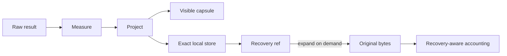

# TokenZero

The output authority for measurement, bounded projection, compression, and byte-exact recovery.

**Status:** released · active development · local-first · recovery-aware · MIT

---

## TL;DR

### The problem

Large file reads, search results, and process logs can consume the model's context. Ordinary summarization saves space by making an irreversible guess about which omitted detail will never matter.

### The answer

TokenZero measures the real serialized output, returns a bounded capsule when that saves context, and keeps every omitted byte behind a local exact ref. Savings are counted after any later recovery.

> **Status:** TokenZero is released and is the output authority behind ZeroKernel. Coordinated engine releases are planned, but parity with FSZero and GraphZero is not claimed until those releases begin.

## What exists now

- Recovery-Aware Context Compression, or RACC, for reads, search results, shell output, and external payloads.
- Content classification, token measurement, bounded projection, protected anchors, and exact `tz://` refs.
- A crash-safe local recovery store with bounded eviction and byte-exact expansion.
- Cross-platform process capture with stream spill for output too large to retain in memory.
- Local Pulse accounting that subtracts tokens later recovered from claimed savings.
- Release archives for Windows, Linux, macOS Apple Silicon, and macOS Intel.

Compression is useful only when the hidden information stays recoverable and the accounting remains honest after the agent asks for some of it back.

## A complete turn in 30 seconds

Inside ZeroKernel, TokenZero runs automatically at operation and response boundaries:

```javascript
const result = await z.run(
  ["cargo", "test", "-p", "zero-kernel", "--test", "direct_host"],
  { timeoutMs: 120_000 },
);

return {
  status: result.status,
  output: result.stdout,
  handles: result.handles,
  accounting: result.accounting,
};
```

Short output passes through. Large or repetitive output may become a capsule with anchors and exact handles. Passing a handle to `z.read` recovers the original bytes.

## What this repository owns

| Owns | Meaning |
| --- | --- |
| Measurement | Tokenizer identity and token counts over the actual serialized value. |
| Projection | A bounded model-visible representation that preserves protected anchors. |
| Compression | Content-aware capsules produced only when they beat raw output. |
| Recovery | Stable local refs to byte-exact omitted payloads and selections. |
| Accounting | Raw, visible, recovered, and net-spent tokens measured from observed output. |
| Output caps | Deterministic limits and typed outcomes at operation and terminal response boundaries. |

**Not owned here:** file identity and effects belong to FSZero. Structural relationships belong to GraphZero. Process ownership, cell cancellation, and final publication belong to ZeroStack.

## Where TokenZero fits

| Boundary | TokenZero action |
| --- | --- |
| `z.read` | Measure large byte views and preserve exact recovery behind the returned handle. |
| `z.find` | Project large hit sets without erasing evidence identity. |
| `z.run` | Project combined stdout and stderr; preserve exact omitted stream bytes. |
| Cell return | Bound the final visible value and record the exact projection in the terminal event. |

TokenZero does not decide which engine runs an operation. It controls what reaches the model and how hidden bytes remain recoverable.

FSZero, GraphZero, and TokenZero are the released products in the family. Once coordinated releases begin, all three engines will publish the same version to signal contract parity. ZeroStack remains source-only and is not part of that version sequence.

## How RACC works



TokenZero may omit text only when the original remains represented by an exact local ref, protected anchor, or an explicitly lossy mode that reports its recovery limits. A capsule never costs more than raw output: small or already-compact values pass through.

## Install

Download the archive for your operating system from the latest GitHub Release, verify its checksum, place the binary on `PATH`, then preview and apply local setup.

```bash
tokenzero install --global --plan  --mcp --shell --cli --json
tokenzero install --global --apply --mcp --shell --cli --json
tokenzero doctor --json
```

Every install apply records rollback data:

```bash
tokenzero install --rollback <id>
```

### Build from source

```bash
git clone https://github.com/AdityaVG13/tokenzero
cd tokenzero
cargo build --release
```

`rust-toolchain.toml` pins the required nightly toolchain.

## Measure, project, recover, account

1. **Measure.** Count the actual serialized value with an identified tokenizer.
2. **Classify.** Detect source, logs, paths, tabular output, errors, or already-small content.
3. **Project.** Return complete output or a bounded capsule with protected anchors.
4. **Recover.** Expand an exact ref, range, symbol, anchor, or hit only when needed.
5. **Account.** Subtract recovered tokens from the savings attributed to the original projection.

### Standalone reproduction

```bash
tokenzero read path/to/large-file.rs --json
tokenzero expand 'tz://blob/<digest>' --json
tokenzero stats --json
```

## Benchmarks

These rows are reproducible examples from the current README evidence. They describe specific fixtures, not every input.

| Input | Raw tokens | Visible | Observed result |
| --- | --- | --- | --- |
| 204-line source file | 1,698 | 1,698 | Returned whole |
| 796-line source file | 7,722 | 287 | 96.3% smaller, exact bytes recoverable |
| 1,539-line source file | 12,908 | 259 | 98.0% smaller, exact bytes recoverable |
| Noisy shell output | 1,237 | 212 | 82.9% smaller, full stream recoverable |

Reproduce a file row with `tokenzero read <file> --json` and inspect its `accounting` block. The retained benchmark runner records exact commands, provenance, failures, byte counts, and labeled non-Q99 estimates.

```bash
  # <!-- audit:skip --> repository benchmark entrypoint verified separately
./benchmarks/run_all.sh
```

Historical local Pulse totals are deployment telemetry, not a release claim, unless a matching public ledger and claim-audit artifact are attached.

## Privacy and telemetry

Shareable usage telemetry is off by default. To opt in, set `TOKENZERO_TELEMETRY=1`. The local `usage-telemetry.jsonl` file records only:

- `execution_path`
- `raw_tokens`
- `spent_tokens`

TokenZero has no telemetry exporter. Nothing leaves the machine unless the operator copies or exports local data.

Recovery objects are separate from the usage ledger and can contain complete source files or command output. Protect the recovery root with appropriate filesystem permissions and retention limits. Turning telemetry off stops new accounting rows; it does not remove recovery objects that active refs still depend on.

## Standalone operator surface

| Area | Commands |
| --- | --- |
| Read and search | `read`, `find`, `grep`, `glob`, `tree` |
| Recover | `expand`, `recall`, `fetch`, `ingest` |
| Measure | `stats`, `pulse`, `mem`, `cache` |
| Operate | `doctor`, `install`, `package-audit` |
| Compatibility | `mcp-server --mode=mcp` |

Classic MCP exists for direct compatibility. Planner-free engine bindings feed ZeroStack. TokenZero does not own multi-engine plan parsing or scheduling.

## Troubleshooting

TokenZero exposes enough accounting to explain why a value passed through, compressed, spilled, or later lost some of its apparent savings. Start with content kind, tokenizer identity, raw and visible counts, recovery handles, and any subsequent expansion events.

<details>
<summary><strong>A small read was not compressed</strong></summary>

This is expected when raw output is already below the visibility budget or when capsule framing, anchors, and refs would cost as much as the original. TokenZero optimizes total task cost, not the percentage shown on every operation.

Inspect the accounting block to confirm raw and visible counts are equal and the content kind was classified correctly. Do not lower thresholds solely to force a compression badge; tiny capsules add indirection without saving context. If a genuinely large repetitive value passes through, capture its content classification and projection decision for diagnosis.

</details>

<details>
<summary><strong>An exact ref does not expand</strong></summary>

The ref identifies content; it does not carry the content or guarantee that every process can reach its store. Expansion fails when the configured recovery root lacks the object, the object was evicted, the ref belongs to another isolated store, or digest verification detects corruption.

Run `tokenzero doctor --json` and inspect the recovery root, store health, and ref scheme. Confirm that the resolving process uses the same durable store or an explicitly shared verified store. Do not rewrite the scheme or fabricate a new digest. If the object was pruned, regenerate it from the original source rather than treating a similar payload as equivalent.

</details>

<details>
<summary><strong>Reported savings dropped after an expand</strong></summary>

That is the intended recovery-aware accounting model. The original projection avoided sending some tokens, but expansion later sent a subset back to the model. Those recovered tokens are therefore subtracted from net savings.

Compare raw, initially visible, recovered, and final spent counts rather than only the first response. A task that eventually expands everything may still benefit from delayed selection, but it should not claim the original headline percentage as net savings. This prevents compression from looking successful merely because its cost moved to a later turn.

</details>

<details>
<summary><strong>Telemetry is missing</strong></summary>

Shareable usage telemetry is off by default, and TokenZero has no exporter. Normal operation still returns per-call accounting; what is absent is the optional local cross-call ledger.

Set `TOKENZERO_TELEMETRY=1` before starting the process if you want the local three-field JSONL ledger. Confirm the recovery directory is writable and inspect it with the Pulse commands. The setting is not retroactive, and enabling it does not upload records or recover calls made while it was disabled.

</details>

## FAQ

RACC separates what the model needs to see now from what the system must preserve exactly. These answers explain where that differs from summarization, caching, shell execution, and ordinary token-count claims.

<details>
<summary><strong>How is RACC different from summarization?</strong></summary>

Summarization replaces source detail with an interpretation chosen before the task is complete. When that interpretation omits the wrong fact, the agent must re-read, re-run, or guess, and there may be no way to prove what the summary changed.

RACC keeps omitted bytes in a content-addressed local store and returns exact refs plus protected anchors. The visible capsule can therefore be aggressive without becoming the only copy. Expansion returns original bytes, not a second summary.

</details>

<details>
<summary><strong>Is TokenZero just a cache?</strong></summary>

No. The recovery store is cache-like in that it retains content-addressed objects, but RACC also classifies content, measures serialized values, chooses projection policy, preserves anchors, enforces output budgets, and accounts for later recovery.

A cache primarily avoids recomputation or I/O. TokenZero's main contract is model-visible output economics with exact recovery. Eviction policy matters because it bounds local storage, but a cache hit alone does not establish token savings.

</details>

<details>
<summary><strong>Does TokenZero own shell execution?</strong></summary>

No. ZeroStack owns command admission, working-directory validation, process creation, timeout, cancellation, exact child-tree termination, and reaping. Those responsibilities determine whether an execution is safe and complete.

TokenZero receives captured stdout and stderr, measures their serialized form, projects a bounded visible result, and preserves omitted stream bytes behind exact handles. Keeping these boundaries separate prevents output formatting from changing process lifecycle semantics.

</details>

<details>
<summary><strong>Can a capsule cost more than raw output?</strong></summary>

The policy should pass through content when capsule framing, anchors, and refs do not reduce the visible cost. That is why small files and path-only outputs often look unchanged.

There can still be local storage and measurement overhead, so “visible tokens did not increase” is not a universal performance claim. Benchmark token counting, projection latency, storage, and end-to-end task behavior separately. TokenZero's README reports measured fixtures rather than promising a saving for every value.

</details>

<details>
<summary><strong>How are token savings calculated after recovery?</strong></summary>

The raw count measures the original serialized value. The visible count measures what entered context initially. Expansion adds recovered tokens to the task's spent total. Net savings compare raw cost with visible plus recovered cost under the same tokenizer.

Exact ref tokens and framing also belong in the visible side of the accounting. Cached or estimated values must be labeled by count kind rather than mixed into exact totals. This is why Pulse can report a lower net percentage than a single compressed response.

</details>

<details>
<summary><strong>Do recovery refs expose private content?</strong></summary>

A `tz://` ref is an identifier, not a public endpoint or an encoded copy of the payload. Someone who sees the string still needs access to a store containing the object.

The underlying bytes remain sensitive and should be protected with the same filesystem permissions and retention policy as other local agent data. Sharing a store or exporting a pack is an explicit data transfer; digest verification proves identity, not authorization.

</details>

<details>
<summary><strong>Is classic MCP still supported?</strong></summary>

Yes. Classic MCP remains useful for clients that require explicit per-operation tools and cannot embed the ZeroKernel host. Its schemas and process model are compatibility concerns owned by the TokenZero package.

Multi-engine agent workflows should use ZeroKernel so filesystem, graph, output, state, cancellation, and transactions share one lifecycle. Registering classic MCP beside ZeroKernel in the same session creates overlapping read and recovery paths and makes accounting harder to interpret.

</details>

## Contributing and security

See `CONTRIBUTING.md` for the focused verification loop and `SECURITY.md` for disclosure. New savings claims require reproducible fixtures and claim-audit evidence.

## License

MIT. See `LICENSE`.
